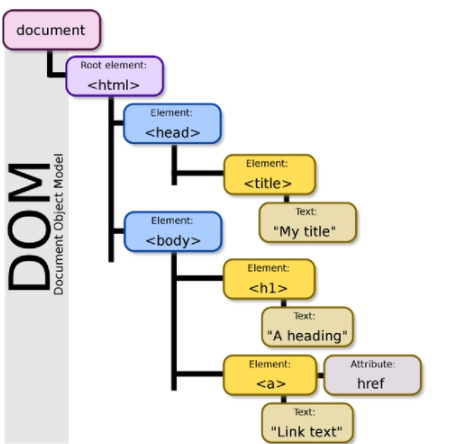

# Front-end

- 웹사이트에서 눈에 보이는 화면

- HTML : 웹 페이지 구조생성
- CSS : 웹 페이지 스타일링
- JS : 웹 페이지 기능 추가


# Back-end

-  데이터와 로직을 담당


# HTML

- **H**yper **T**ext **M**arkup **L**anguage
  - 웹페이지를 구조화하기 위한 언어

  - Hyper Text
    - 하이퍼링크를 통해 사용자가 한 문서에서 다른 문서로 즉시 접근할 수 있는 텍스트

  - Markup
    - 태그를 이용하여 문서나 데이터의 구조를 명시하는 언어
    - 마크다운도 마크업을 이용해 만든 언어 중 하나

- WHATWG 표준
- 참조 가능한 사이트
  - mdn
  - w3schools


# HTML 기본 구조

```html
<!DOCTYPE html>
<html> 
   
    <head>
        <meta charset="UTF-8"> <!--메타데이터(인코딩)-->
        <title>Document</title> <!--문서 제목-->
        <link rel="stylesheet" href="style.css"> <!--외부참조 스타일 적용-->
        <script src="javascript.js"></script> <!--스크립트 요소-->
        <!--내부참조 스타일 적용-->
        <style>
        p {
            color: black;
            }
        </style>
    </head>

    <body>

    </body>
</html>
```

### html

- 문서의 최상위 요소


### head

- 문서 메타데이터 요소
- 문서 제목, 인코딩, 스타일, 외부 파일 로딩 등


### body

- 문서 본문 요소
- 실제 화면 구성


### DOM(Document Object Model) 트리

- html 문서를 브라우저에서 렌더링하기 위한 구조
  - 렌더링 : 웹 상에 문서를 표현
  - 문서 내의 각 요소에 접근 / 수정이 용이하다
  - 각 내부 요소의 들여쓰기는 스페이스바 2개로 정의



### 요소

```html
<a href="https://google.com"></a>
```

- 여는 태그와 닫는 태그로 구성 (대소문자를 구분하지 않음)
  - 태그 오류에도 에러가 나지 않고 깨져 보임
    - 디버깅이 어렵다
- 속성값의 공백은 없이, 쌍따옴표(`"`)를 사용
- 내용이 없는 태그도 존재 (닫는 태그 없음)
  - `br` : 줄바꿈
  - `hr` : 수평선
  - `img` : 이미지 링크
  - `input` : 인풋
  - `link` : 외부파일 참조
  - `meta` : 메타데이터
- 각 요소는 중첩될 수 있다


### 속성(attribute)

- `<a href="https://google.com"></a>`
  - `href` :  속성, `"https://google.com"` : 속성값
  - 공백은 쓰지 않음
  - 쌍따옴표 사용
- 요소는 속성을 가질 수 있으며, 경로나 크기 같은 추가 정보를 제공
- 시작 태그에 작성하며 이름과 값이 하나의 쌍으로 존재
- 태그와 상관없이 사용 가능한 속성(global attribute)도 존재
  - `id` : 문서 전체에서 유일한 고유 식별자 지정
  - `class` : 공백으로 구분된 해단 요소의 클래스 목록
  - `data-*` : 페이지에 사용자 데이터를 저장
  - `style` : 인라인 스타일 지정
  - `title` : 요소에 대한 추가 정보 지정
  - `tabindex` : 페이지에서 탭을 눌렀을 때의 순서 지정


# 시맨틱 태그

- HTML 태그에 의미론적 요소를 담음
- 수많은 div 영역 중 의미 있는 영역을 표현할 수 있음
- 검색엔진최적화(SEO)를 위해 효과적으로 활용
- `<header>` : 문서의 헤더
- `<nav>` : 네비게이션
- `<aside>` : 사이드에 위치한 공간, 메인 콘텡츠와 관련이 적은 것
- `<section>` : 문서의 일반적인 구분
- `<article>` : 페이지 안에서 독립적으로 구분되느 영역
- `<footer>` : 문서의 전체나 섹션의 마지막 부분
