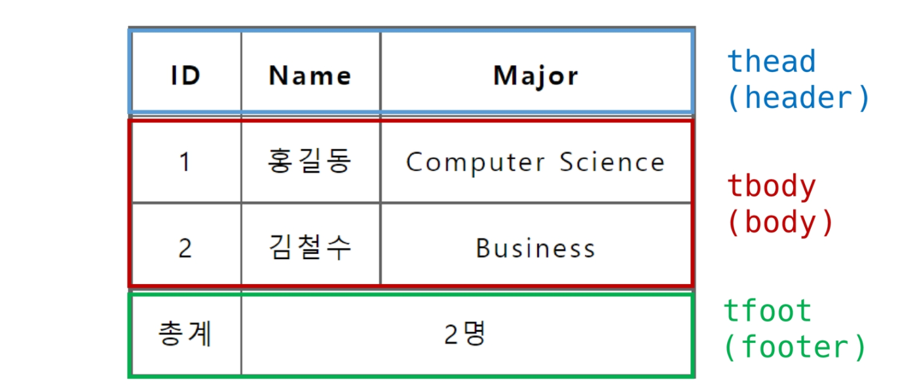
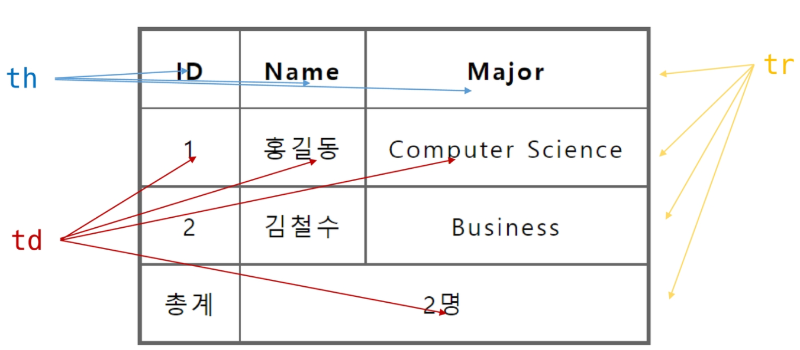
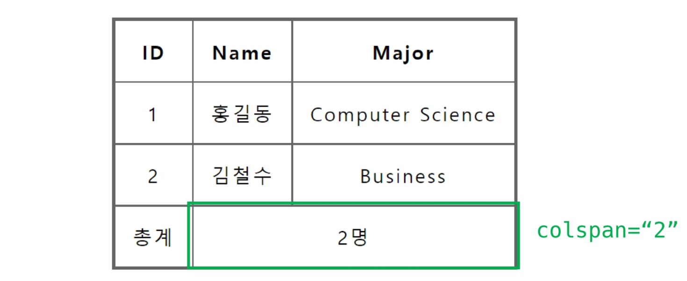

# 텍스트 요소

- `<a></a>` : href 속성을 이용하여 링크 연결
- `<b></b>` or `<strong></strong>` : 굵은 글씨
- `<i></i>` or `<em></em>` : 기울임체
- `<br>` : 줄 바꿈
- `` : src 속성을 이용해 이미지 표현
- `<span></span>` : 의미없는 인라인 컨테이너. 특정 요소를 지목하기 위해 사용 


# 그룹 컨텐츠

- `<p></p>` : 하나의 문단
  - 태그 안 쪽에 인라인요소만 포함되어야 함
- `<hr>` : 수평선. 문단 레벨 요소에서의 주제의 분리
- `<ol></ol>` : 순서가 있는 리스트
- `<ul></ul>` : 순서가 없는 리스트
- `<pre></pre>` : 공백문자, 줄 바꿈을 유지해 표현
  - 글꼴과 크기가 지정되어 있음
- `<blockquote></blockquote>` : 텍스트가 긴 인용문
- `<div></div>` : 의미 없는 블록 레벨 컨테이너
  - 웹 페이지에서 구역을 나눌 때 사용


# 표(table)

```html
<body>
    <table>
        <thead>
            <tr>
                <th>ID</th>
                <th>Name</th>
                <th>Major</th>
            </tr>
        </thead>
        <tbody>
            <tr>
                <td>1</td>
                <td>홍길동</td>
                <td>Computer Science</td>
            </tr>
            <tr>
                <td>2</td>
                <td>김철수</td>
                <td>Business</td>
            </tr>
        </tbody>
        <tfoot>
            <tr>
                <td>총계</td>
                <td colspan="2">2명</td>
            </tr>
        </tfoot>
        <caption>1반 학생 명단</caption>
    </table>
</body>
```









# Form

```html
<form action="/search" method="GET">
    <label for="agreement">개인정보 수집에 동의합니다.</label>
    <input type="checkbox" name="agreement" id="agreement">
</form>
```

- 서버에 데이터를 제출하기 위한 영역
- 기본 속성
  - **action** : form을 처리할 서버의 URL
  - **method** : form을 제출할 때 사용할 HTTP 메서드 (GET or POST 사용)
    - get : 쿼리스트링 형태로 url에 그대로 표출
      - 보안이 약하므로 보여도 되는 공간에 주로 활용 
      - 메서드를 지정하지 않으면, get이 기본
  - enctype : method가 post일 경우의 데이터 유형

### input

- 다양한 타입을 가지는 입력
- name, value : form control에 적용되는 이름과 값, 이름-값이 페어로 전송됨


### input label

- label을 클릭하여 input에 초점을 맞추거나 활성화시킬 수 있음
- `<input>`의 id속성과 `<label>`의 for 속성이 상호 연관되어야함


### input 유형

- text : 일반 텍스트 입력
- password : 입력시 값이 보이지 않고 `*`로 표현
- email : 반드시 이메일 형식이어야 form 제출 가능
- number : 숫자 범위 설정
- file : 파일 첨부, accept 속성을 활용해 파일 타입을 지정 가능
- checkbox : 다중 선택
- radio : 단일 선택
- color : 색상 선택
- date : 날짜 선택

- hidden : 사용자에게 보이지 않는 입력. 받아오진 않지만 서버에 전송되어야 하는 값을 설정