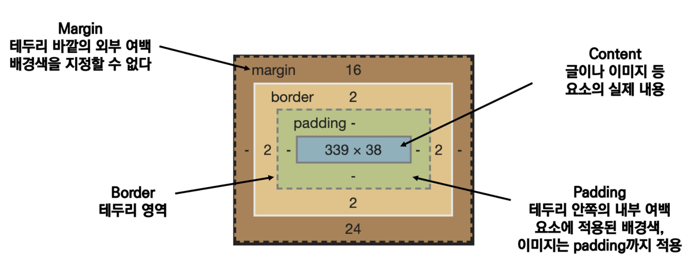
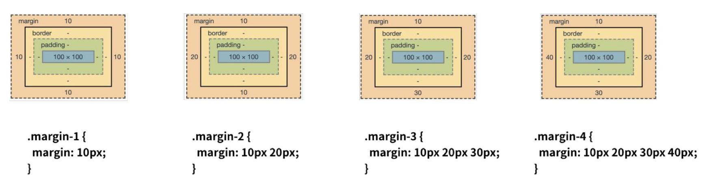

# CSS 원칙

- Normal Flow : 모든 요소는 Box model이고, 좌측 상단부터 채워넣는다

# Box model

- 모든 HTML요소는 box 형태로 이루어져 있음
- box는 네 가지 영역으로 이루어짐
  - content
  - padding
  - border
  - margin

# Shorthand

- margin shorthand
  - 1개 지정 : 4면 동일
  - 2개 지정 : 상하 - 좌우 (`+`)
  - 3개 지정 : 상 - 좌우 - 하 (`%`)
  - 4개 지정 : 상 - 우 - 하 - 좌 (시계방향)
- border shorthand
  - 테두리 둘레 - 형태 - 색상 순으로 지정

# Box-sizing

- 기본적인 box-size는 content-box 기준
- 우리가 원하는 일반적인 영역은 border-box
- Box-sizing으로 기준을 바꿔줘야함
