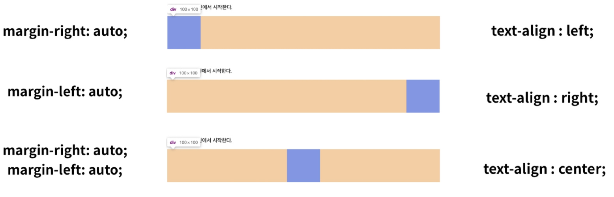

# Display

- display에 따라 크기와 배치가 달라진다.
  - `display: block`
    - 줄바꿈이 일어나는 요소
    - 화면 크기 전체 폭을 차지
      - 너비를 가질 수 없다면 자동으로 그 크기만큼의 margin이 부여
    - 블럭 레벨 요소 안에 인라인 레벨 요소가 들어갈 수 있음
    - `div`, `ul`, `ol`, `li`, `p`, `hr`, `form` 등
  - `display: inline`
    - 줄바꿈이 일어나지 않는 행의 일부
    - content 너비만큼의 폭을 차지
    - `width`, `height`, `margin-top`, `margin-bottom` 지정 불가
    - 상하 여백은 `line-height`로 지정
    - `span`, `a`, `img`, `input`, `label`, `b`, `em`, `i`, `strong` 등
  - `display: inline-block`
    - 블록과 인라인 레벨 요소의 특징을 모두 가짐
    - 인라인처럼 한 줄에 표시하고 `width`, `height`, `margin`을 지정할 수 있음
  - `display: none`
    - 해당 요소를 화면에 표시하지 안고, 공간도 부여하지 않음
    - 이에 반해 `visibility: hidden`은 화면에서만 숨김

- 요소 별 정렬하기

# Position

- 문서 상에서 요소의 위치를 지정
- static : 기본값
  - Normal Flow - 좌측 상단부터 배치 
  - 부모 요소 내에서는 부모 요소의 위치를 기준으로 배치
- relative : 상대 위치
  - static 일 때와 배치가 같음, normal flow 유지
- absolute : 절대 위치
  - Normal Flow에서 벗어나며, 레이아웃에서 공간을 차지하지 않음
  - 가장 가까이 있는 부모 요소의 위치를 기준으로 이동
- fixed : 고정 위치
  - Normal Flow에서 벗어나며, 레이아웃에서 공간을 차지하지 않음
  - 부모 요소와 관계 없이 viewport를 기준으로 이동, 스크롤 시에도 동일 위치
