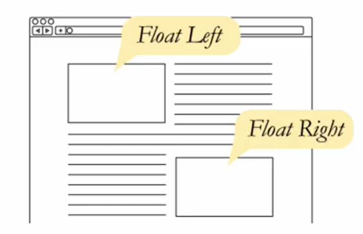

# Float

```html
<style>
    .left {
        float: left;
    }
</style>
```




- 박스를 왼쪽이나 오른쪽으로 이동시켜 인라인 요소들이 주변을 감싸도록 함
- 요소가 Normal flow를 벗어남

- none : 기본값
- left : 요소를 왼쪽으로 띄움
- right : 요소를 오른쪽으로 띄움

- clearing : float 요소의 부모 div에 높이를 지정해주어 공간을 차지하도록 함
  - 이후의 요소가 float의 영향을 받지 않고, Normal flow를 따르게 하기 위함

```html
<head>	    
    <style>
        /* ::after - 선택한 요소의 맨 마지막 자식으로 가상 요소 생성 */
        .clearfix::after {
            content: "";
            display: blocd;
            clear: both;
        }
    </style>
</head>

<body>
    <!--clearfix : float 요소의 부모로 div를 두고 .clearfix 적용-->
    <div class="clearfix">
        <!--float요소-->
    	<div class="box1 left">
            box1
        </div>
    </div>
</body>
```
