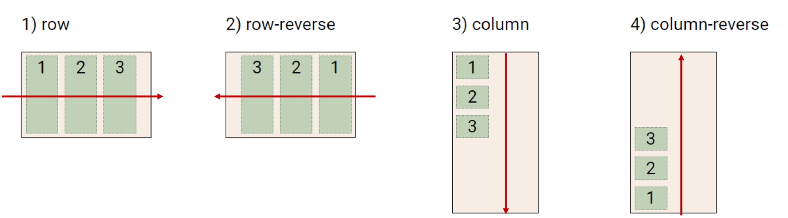
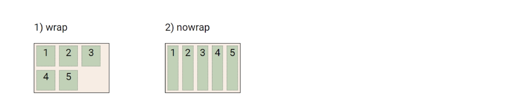
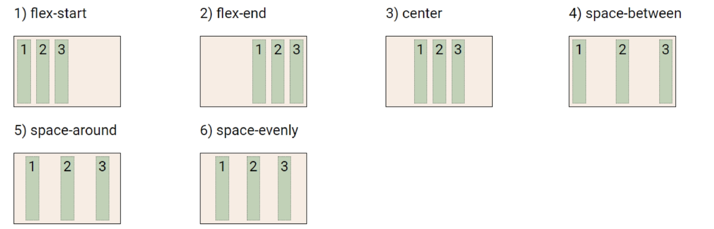
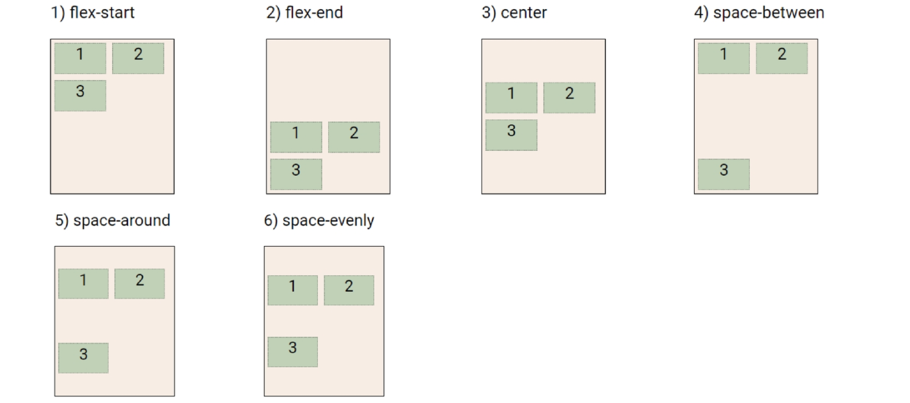
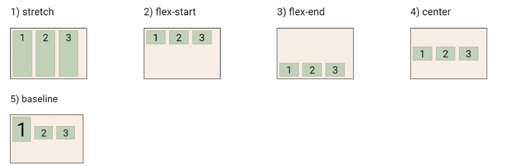
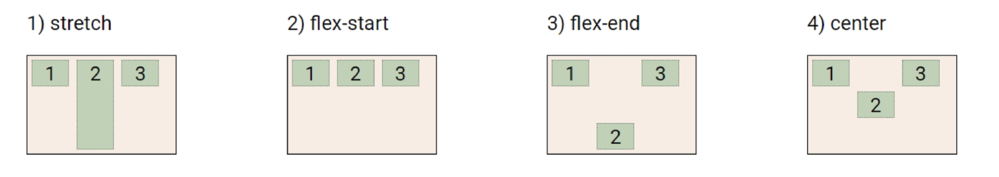

# Flexbox

```html
<!--부모(Felxbox)에 적용-->
<style>
    .flex-container {
        display: flex;
    }
</style>
```

- 행과 열 형태로 아이템을 배치하는 1차원 레이아웃 모델
- 축
  - main axis - 메인축
  - cross axis - 교차축 : 메인축과 수직
- 구성요소
  - Flex Container : 부모 요소
  - Flex Item : 자식 요소
- 수직 정렬이 가능
- 아이템의 너비와 높이, 간격을 동일하게 배치


- flex-direction

  - row : 가로가 메인축

  - row-reverse : 순서가 반대. 우측부터 배치

  - column : 세로가 메인축

  - column-reverse : 순서가 반대. 아래부터 배치




- flex-wrap : 개별아이템이 flexbox를 벗어나지 않도록 구성

  - wrap : 넘어가면 다음 줄에 배치 
  - nowrap : 기본값. 한 줄에 배치
  - wrap-reverse : 아래부터 wrap




- jusity-content
  - flex-start : 기본. 빈 영역을 우측에 둠
  - flex-end : 빈 영역을 왼쪽에 둠
  - center : item들을 가운데 정렬
  - space-between : item 사이에 같은 공간 배치
  - space-around : item을 둘러싼 영역에 같은 공간 배치
  - space-evenly : 모든 여백에 같은 공간 배분




- align-content : 2줄 이상의 item 묶음(wrap)을 배치
  - flex-start : item의 묶음을 상단에 배치
  - flex-end : item의 묶음을 하단에 배치
  - center : item의 묶음을 중앙에 배치
  - space-between : 줄 사이의 간격을 동일하게 배치
  - space-around : 줄 주변 공간을 동일하게 둠
  - space-evenly : 모든 여백에 같은 공간 배분




- align-items : 모든 아이템을 Cross axis 기준으로 정렬
  - stretch : 기본값. 아이템을 늘여 컨테이너를 가득 채움
  - flex-start : 위
  - flex-end : 아래
  - center : 가운데
  - baseline : 텍스트 baseline에 기준선을 맞춤




- align-self : 개별 아이템을 Cross axis 기준으로 정렬
  - stretch : 기본값. 아이템을 늘여 컨테이너를 가득 채움
  - flex-start : 위
  - flex-end : 아래
  - center : 가운데




- Flex item 개별 속성
  - `order` : Item의 순서를 설정
  - `flex-grow` : 화면 크기에 따라 Item의 너비 증가(grow) 비율 설정
  - `flex-shrink` : 화면 크기에 따라 Item의 너비 감소(shrink) 비율 설정
  - `flex-basis` : Item의 기본 너비 설정
    - 인라인 요소인 item 에도 적용 가능
  - `flex` : `flex-grow` , `flex-shrink` , `flex-basis` 에 대한 단축 속성!
    - `flex-grow`는 생략 불가
    - `flex-basis`의 기본값은 auto이나, `flex` 속성에서 `flex-basis`를 생략할 경우, 0 값이 들어감
