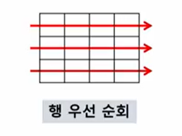
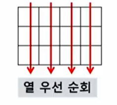
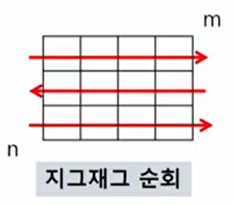

# 알고리즘의 표현

- 슈더코드
  - 코드가 돌아가는 문법과 비슷한 형태로 작성
  - 실제로 작동하지는 않지만 구현되기 전에 알고리즘의 형태를 보여줌

```python
def CalcSum( n ) :
    sum <- 0;
    for i in range (1, n+1) :
        sum <- sum + i;
    return sum;
```


- 순서도
  - 알고리즘을 도형의 요소로 표현


# 알고리즘의 성능

- 공간 복잡도
- 시간 복잡도
  - 실제 걸리는 시간을 측정
  - 실행되는 명령문을 계산
  - 공간에 대한 비용이 컸던 과거에 비해 시간복잡도가 더욱 중요해짐
  - 빅-오 표기법
    - O(n의 최고차항)
    - 최악의 경우를 가정


# 리스트

- 하나의 변수 선언으로 둘 이상의 값에 접근 가능


# 정렬

- 버블 정렬 (Bubble Sort)
  - 인접한 두 개의 원소를 비교해 자리 교환
  - 한 단계가 끝나면 가장 큰 원소가 마지막 자리로 이동
  - 시간 복잡도 O(n^2)
- 카운팅 정렬 (Counting Sort)
  - 각 원소 숫자의 개수를 또 다른 리스트에 저장
  - 정수 자료에만 적용 가능 (일반적으로 자연수에 적용)
  - 시간 복잡도 O(n+K)
- 선택 정렬 (Selection Sort)
- 퀵 정렬 (Quick Sort)
- 삽입 정렬 (Insert Sort)
- 병합 정렬 (Merge Sort)


# 완전 검색 (Exaustive Search)

- 생각할 수 있는 모든 경우의 수를 나열
- 수행속도는 느리지만, 해답을 찾지 못할 확률이 적다


# 탐욕(Greedy) 알고리즘

- 최적해를 구하는 근시안적인 방법
- 여러 경우 중 각 순간에 최적인 것은 선택, 최종적인 해답에 도달한다.
- 지역적으로는 최적이지만, 전역적으로 최적임을 보장할 수 없다.

- 일반적으로 머릿속에 떠오르는 생각은 Greedy 접근법
- 동작과정
  1) 해 선택 : 부분 최적해를 해 집합에 추가
  2) 실행가능성 검사 : 문제의 제약조건 위반 여부를 검사
  3) 해 검사 : 부분해 집합이 문제의 해가 되는지 검사


# 2차원 배열

- 행 우선 순회



```python
for i in range(n):
    for j in range(m):
        Array[i][j]
```


- 열 우선 순회



```python
for i in range(m):
    for i in range(n):
        Array[i][j]
```


- 지그재그 순회



```python
for i in range(n):
    for j in range(m):
        Array[i][j + (m-1-2*j) * (i%2)]
```


- 델타를 이용한 사방 탐색

```python
arr # NxN
di[] = [0, 0, -1, 1] # 좌우상하
dj[] = [-1, 1, 0, 0]
for i in range(N-1):
	for j in range(N-1):
        for k in range(4):
            ni = i + di[k]
            nj = j + dj[k]
```


# 부분집합

- 모든 부분집합을 만드는 방법 (완전 검색)

- 비트 연산자
  - `&` : 비트 단위로 AND 연산
    - `i & (1 << j)` : i의 j번째 비트가 1인지 검사
  - `|` : 비트 단위로 OR 연산
  - `^` : 두 값이 다를 때 True
  - `<<` : shift 연산자. 비트 열을 왼쪽으로 이동
    - `1 << n` : 2^n, 원소가 n개일 때 부분집합의 수
  - `>>` : shift 연산자. 비트 열을 오른쪽으로 이동

- 보다 간결하게 부분집합 생성하는 방법

```python
arr = [3, 6, 7, 1, 5, 4]

n= len(arr)

for i in range(1<<n):		# 1<<n : 부분 집합의 개수
    for j in range(n):		# 원소의 수만큼 비트를 비교
        if i & (1<<j):		# i의 j번 비트가 1인 경우
            print(arr[j], end=", ")
```


# 검색

- 저장되어 있는 자료 중에서 원하는 항목을 찾는 작업

- 목적하는 탐색 키를 가진 항목을 찾는 것

- 검색의 종류

  - 순차 검색

    - 일렬로 되어 있는 자료를 순서대로 검색
    - 가장 간단하고 직관적
    - 검색 대상이 많을 경우 수행시간이 급증
    - 마지막까지 검색대상을 찾지 못하면 실패
    - 정렬되어 있지 않은 경우
      - 비교 횟수 : (n+1)/2
    - 정렬되어 있는 경우
      - 키 값이 검색대상보다 크면 검색 중지

  - 이진 검색

    ```python
    def binarySearch(a, N, key):
        start = 0
        end = N-1
        while start <= end:
            middle = (start + end) // 2
            if a[middle] == key:	# 검색 성공
                return True
            elif a[middle] > key:
                end = middle - 1
            else:
                start = middle + 1
        return false
    ```

    - 자료의 가운데 있는 항목의 키 값과 비교
    - 다음 검색의 위치 설정, 검색 범위 반감
    - 전제 : 자료가 정렬된 상태
      - 자료의 삽입이나 삭제가 발생했을 때, 정렬하는  추가 작업이 필요

  - 해쉬


# 선택 정렬

- 가장 작은 값의 원소부터 차례대로 선택하여 위치를 교환
- O(n^2)


# 셀렉션 알고리즘

- k번째로 작은(큰) 원소를 찾는 알고리즘
- k번째로 작은 원소까지 정렬시키고 k번째 원소를 반환


# DP 알고리즘 (Dynamic Planning)


# DFS (깊이우선탐색)

- 한 반향으로 갈 수 있는 경로로 깊이 탐색하다가 더 이상 진행할 수 없을 때 갈림길으로 돌아옴
- 스택을 이용하여 구현
  - 시작 정점 v를 결정
  - 방문하지 않은 w가 있다면, v를 push한 후에 w 방문
  - 방문하지 않은 정점이 없다면 pop하여 되돌아가 탐색 방향을 바꿈

```python
visited = []
stack = []
DFS(v)
	v 방문;
    visited[v] <- true;
    do {
        if (v의 인접 정점 중 방문 안한 w 찾기)
        	push(v);
        	while( w ){
                w 방문;
                visited[w] <- true;
                push(w);
                v<-w;
                v의 인접 정점 중 방문 안한 w 찾기
            }
        	v<-pop(stack);
    } while(v)
end DFS()
```


# BFS (너비우선탐색)

- 큐를 이용하여 구현


# 계산기

- 문자열로 된 계산식이 주어질 때, 스택을 이용하여 계산 가능
  - 중위표기법
    - A+B
  - 후위표기법
    - AB+

- 구현

1. 중위표기법에서 후위표기법으로 변환
2. 
