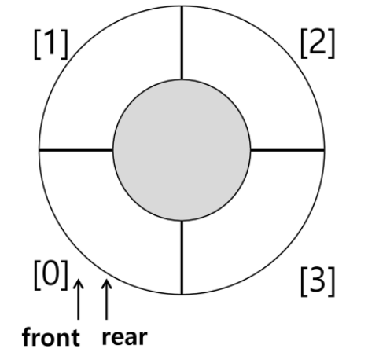
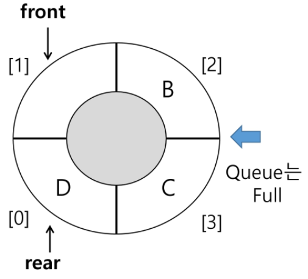

# Queue

- 뒤에서 삽입, 앞에서 삭제하는 선입선출 구조
- FIFO (First In First Out)
- Front : 첫 번째 원소의 한 칸 앞, 공백의 인덱스
  - 최초 -1로 초기화
- Rear : 저장된 원소 중 마지막 원소의 인덱스
  - 최초 -1로 초기화


# 주요연산

- `enQueue(item)` : rear에 item을 삽입
- `deQueue()` : front 원소를 삭제 후 반환
- `createQueue(size)` : size 만큼의 공백의 큐를 생성
- `isEmpty()` : 큐가 공백인지 확인
  - 공백 : front == rear 인 상태
- `isFull()` : 큐가 포화인지 확인
  - 포화 : rear == size - 1
- `Qpeek()` : 검색, front를 삭제없이 반환

```python
def isEmpty():
    return front == rear


def isFull():
    return rear == len(Q) - 1


def enQueue(item):
    global rear
    if isFull():
        print("꽉 찼어")
    else:
        rear += 1
        Q[rear] = item


def deQueue():
    global front
    if isEmpty():
        print('비었어')
    else:
        front += 1
        return Q[front]


def Qpeek():
    if isEmpty():
        print('비었어')
    else:
        return Q[front+1]

    
# 큐를 의미대로 사용하기 위해선
# 미리 그 크기가 선언되어 있어야 함.
Q = [0] * 3
front = -1
rear = -1

# 1, 2, 3을 차례로 삽입하고 차례로 삭제
enQueue(1)
print(Q)
enQueue(2)
print(Q)
enQueue(3)
print(Q)
print(deQueue())
print(deQueue())
print(deQueue())
```

- 선형 큐의 문제: 삽입과 삭제를 반복할 경우, 앞부분이 비어있음에도 rear가 뒤로 밀려 포화상태로 인식
  - `.pop(0)`처럼 원소들을 한칸씩 당기는 방법을 사용할 수 있으나, 효율성이 급감
  - 원형 큐를 이용해 해결 가능


# 원형 큐

- 생김새는 그대로 1차원 배열이지만, 논리적으로 배열의 처음과 끝이 연결되어 있음을 가정
- 최초 공백상태는 front = rear = 0 으로 초기화
- `% n` 을 사용하여, n-1 이후에는 인덱스 0으로 순환
  - 삽입 위치 : (rear + 1) % n
  - 삭제 위치 : (front + 1) % n
- 공백과 포화를 모두 front == rear 로 진단

- 공백과 포화 상태를 구분하기 위해 front에는 원소를 두지 않음

  - 공백

    

  - 포화

    


# 우선순위 큐 (Priority Queue)

- 항목들이 우선순위를 가져, 우선순위가 높은 순서로 나가게 됨
- 삽입할 때 우선순위를 비교하여 적절한 위치에 삽입
- 가장 앞에 최고 우선순위 원소가 위치
- 삽입이나 삭제에 원소의 재배치가 일어나고, 소요되는 시간이나 메모리 낭비가 큼


# 버퍼 (Buffer)

- 데이터를 전송하는 공안 일시적으로 그 데이터를 보관하는 메모리
- 버퍼링 : 버퍼를 채우는 동작
- 순서대로 입력/출력/전달되어야 하므로 큐를 활용


# BFS (Breadth First Search)

- 너비 우선 탐색
- 먼저 인접한 정점을 모두 탐색, 탐색한 정점들에 인접한 정점을 차례로 방문
- 큐를 활용

```python
# G 그래프, v 시작 정점, n 정점 개수
def BFS(G, v, n):
    visited = [0] * (n+1)
    queue = []
    queue.append(v) 			# 시작점 v 삽입
    visited[v] = 1
    while queue:				# 큐가 빌 때까지
        t = queue.pop()
        visited[t] = 1
        for i in G[t]:			# t와 연결된 모든 정점에 대해
            if not visited[i]: 	# 방문하지 않은 곳이라면
                queue.append(i) # 큐에 넣기
```


# 데크 (deque)

- 일반적인 리스트는 `list.pop(0)`을 할 경우 항목의 재배치가 요구되어 O(n)의 연산이 소요
- 반면 데크는 양끝 항목의 삽입 또는 제거가 압도적으로 빠르다

```python
from collections import deque

deq = deque()
```

- 데크의 메서드

  - `deque.append(item)`: item을 데크의 오른쪽 끝에 삽입

  - `deque.appendleft(item)`: item을 데크의 왼쪽 끝에 삽입

  - `deque.pop()`: 데크의 오른쪽 끝 항목을 가져오는 동시에 데크에서 삭제

  - `deque.popleft()`: 데크의 왼쪽 끝 항목을 가져오는 동시에 데크에서 삭제

  - `deque.extend(array)`: array를 순환하면서 데크의 오른쪽에 추가

  - `deque.extendleft(array)`: array를 순환하면서 데크의 왼쪽에 추가

  - `deque.remove(item)`: item을 데크에서 찾아 삭제

  - `deque.rotate(num)`: 데크를 num만큼 회전 (양수면 오른쪽, 음수면 왼쪽).