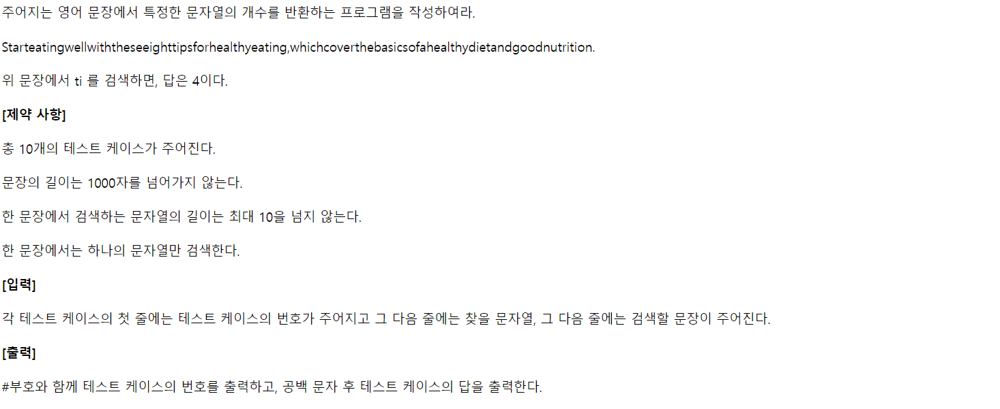
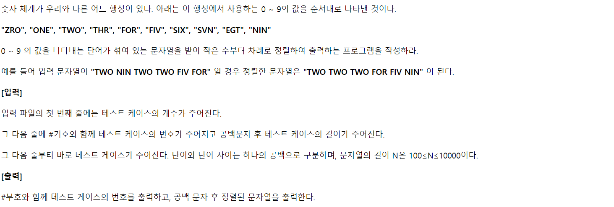

# 1. 연습문제

- 주어진 문자열을 거꾸로 출력하라.

```python
def myReverse(S):
    # 문자열이 주어지면 문자열, 리스트가 주어지면 리스트 생성
    if type(S) == type(''):
        temp = ''
    if type(S) == type([]):
        temp = []

    # 뒤에서부터 하나씩 이어 붙이기
    for i in range(len(S)):
        temp += S[-i-1]

    return temp


T = int(input())

for tc in range(1, T+1):
    S = input()
    print(f'#{tc} {myReverse(S)}')
```


# 2. 연습문제

- 주어진 정수를 문자열로 변환하라

```python
def myItoa(N):
    # 문자열 리스트 s_list의 각 항목은 인덱스와 값이 같음 (타입은 다름)
    s_list = ['0', '1', '2', '3', '4', '5', '6', '7', '8', '9']

    # 음수일 경우 양수로 변경, 음수 여부 저장
    if N < 0:
        temp = -N
        is_minus = True
    else:
        temp = N
        is_minus = False

    # 정수 N의 각 자리(뒤부터)를 리스트에 저장
    temp_list = []
    while True:
        # 10으로 안 나누어질 땐 마지막 자리 저장하고 끝
        if temp // 10 == 0:
            temp_list.append(temp % 10)
            break
        temp_list.append(temp % 10)
        temp = temp // 10

    # 결과 저장
    rlt = ''
    # 뒷자리부터 저장했으니 뒤집어서 탐색
    for i in temp_list[::-1]:
        rlt += s_list[i]
        
    # 음수였다면 문자열 앞에 '-' 추가
    if is_minus:
        rlt = '-' + rlt

    return rlt

# 테스트케이스 6개
T = 6
for tc in range(1, T+1):
    N = int(input())
    print(f'#{tc} {myItoa(N)} {type(myItoa(N))}')
```


# 3. SWEA-1213



```python
# 테스트 케이스 10개
for _ in range(10):
    tc = int(input())
    target = input()
    sentence = input()
    cnt = 0

    # 문장을 순회하며
    for i in range(len(sentence)):
        # 첫 글자가 같은 때만 비교
        if sentence[i] == target[0]:
            # 해당 지점부터 목표 문장열과 같다면
            if sentence[i:i+len(target)] == target:
                cnt += 1

    print(f'#{tc} {cnt}')
```


# 4. SWEA-1221



```python
# bubble sort : 매우 오래 걸림
import sys
sys.stdin = open('GNS_test_input.txt')

nums = ['ZRO', 'ONE', 'TWO', 'THR', 'FOR', 'FIV', 'SIX', 'SVN', 'EGT', 'NIN']

T = int(input())
for tc in range(1, T+1):
    info = input()
    str_lst = input().split()

    for j in range(len(str_lst)):
        for i in range(len(str_lst)-1):
            if nums.index(str_lst[i]) > nums.index(str_lst[i+1]):
                str_lst[i], str_lst[i+1] = str_lst[i+1], str_lst[i]

    print(f'#{tc}')
    print(' '.join(str_lst))
```

```python
# 같은 문자끼리의 순서는 고려하지 않는 count sort
import sys
sys.stdin = open('GNS_test_input.txt')

nums = ['ZRO', 'ONE', 'TWO', 'THR', 'FOR', 'FIV', 'SIX', 'SVN', 'EGT', 'NIN']

T = int(input())
for tc in range(1, T+1):
    info = input()
    str_lst = input().split()
    cnt = [0] * 10
    sorted_str_lst = []

    # 문자열을 순회하며 해당 숫자(문자로 된)에 해당하는 칸에 +1
    for i in range(len(str_lst)):
        cnt[nums.index(str_lst[i])] += 1

    for i in range(len(cnt)):
        for j in range(cnt[i]):
            sorted_str_lst.append(nums[i])

    print(f'#{tc}')
    print(' '.join(sorted_str_lst))
```