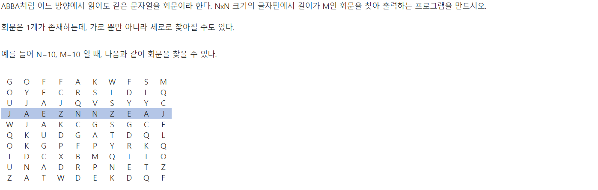
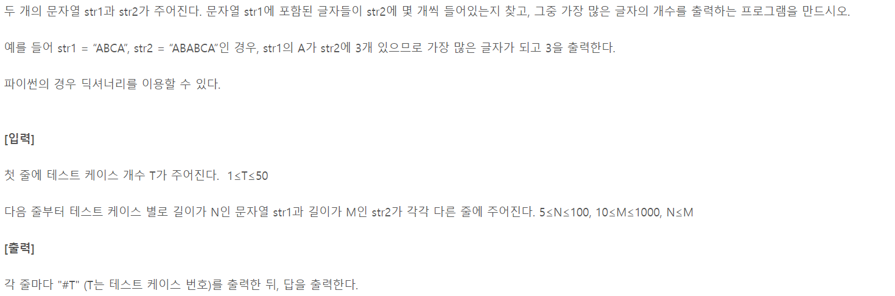
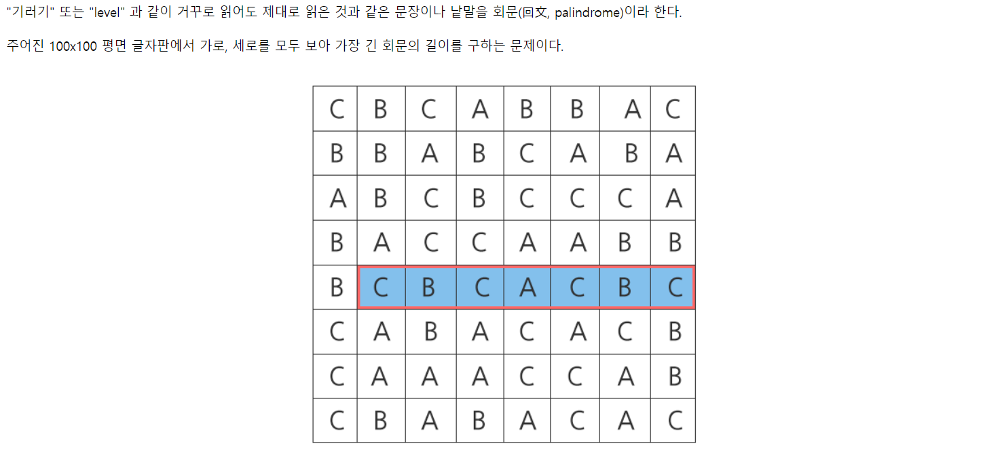
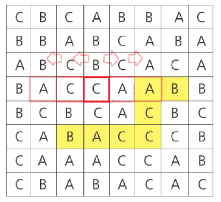

# 1. SWEA-4864


```python
T = int(input())
for tc in range(1, T+1):
    str1 = input()
    str2 = input()

    is_in = 0

    # str2를 str1 길이만큼 남기고 순회
    for i in range(len(str2)-len(str1)+1):
        # 첫글자가 나오면 비교 시작
        if str1[0] == str2[i]:
            # 끝까지 비교
            if str1 == str2[i:i+len(str1)]:
                is_in = 1
    
    print(f'#{tc} {is_in}')
```


# 2. SWEA-4861




```python
import sys
sys.stdin = open('sample_input.txt')

# 회문임을 판단하는 함수
def isPalindrome(str_lst):
    if str_lst == str_lst[::-1]:
        return True
    else:
        return False

def findPalindrome(matrix, M):
    # 가로 문자열 판단
    for r in range(len(matrix)):
        for c in range(len(matrix)-M+1):
            # 각 위치에서 가로길이 M짜리 문자열
            str_hor = matrix[r][c:c+M]
            if isPalindrome(str_hor):
                return ''.join(str_hor)

    # 세로 문자열 판단
    for r in range(len(matrix)-M+1):
        for c in range(len(matrix)):
            # 각 위치에서 세로길이 M짜리 문자열
            str_ver = ''
            for k in range(M):
                str_ver += matrix[r+k][c]
            if isPalindrome(str_ver):
                return ''.join(str_ver)

    return '회문없음'

T = int(input())
for tc in range(1, T+1):
    # NxN, 회문 길이 M
    N, M = map(int, input().split())
    matrix = [list(input()) for _ in range(N)]

    print(f'#{tc} {findPalindrome(matrix, M)}')
```


# 3. SWEA-4865



```python
T = int(input())
for tc in range(1, T+1):
    str1 = input()
    str2 = input()
    max_cnt = 0

    # str1 에 있는 각 문자들을
    for i in str1:
        cnt = 0

        # str2 에서 찾아
        for j in str2:
            # 같으면 +1
            if i == j:
                cnt += 1

        if max_cnt < cnt:
            max_cnt = cnt

    print(f'#{tc} {max_cnt}')
```


# 4. SWEA-3143


```python
T = int(input())
for tc in range(1, T+1):
    A, B = input().split()

    i = 0
    # B 의 등장횟수
    cnt = 0
    # 인덱스 에러가 나지 않을 만큼 A 순회 
    while i < len(A)-len(B)+1:
        # B를 만나면
        if A[i:i+len(B)] == B:
            # 하나 세고 다음 문자로 점프!
            cnt += 1
            i += len(B)
        else:
            i += 1

    # 타이핑 최솟값은 전체 문자길이 - C 등장 횟수 * B 칠 때 단축되는 길이
    min_tab = len(A) - cnt * (len(B) - 1)
    print(f'#{tc} {min_tab}')
```


# 5. SWEA-1216




- 로직

  - 한 좌표에서 양쪽(상하) 한 칸씩 확장하면서 회문 검사

  - 확장을 거듭하다 회문이 아니게 되면 break

  - 홀수인 경우와 짝수인 경우 나눠 풀이



```python
import sys
sys.stdin = open('input.txt')

# 회문임을 판단하는 함수
def isPalindrome(lst):
    if lst == lst[::-1]:
        return True
    else:
        return False

# 홀수일 때
def countPalindromeOdd(matrix, r, c):
    max_cnt = 0

    # 확장할 수 있는 길이 설정
    if 50 <= r:
        safe_r = 99 - r
    else:
        safe_r = r

    if 50 <= c:
        safe_c = 99 - c
    else:
        safe_c = c

    # 가로 먼저 검사
    for k in range(safe_c+1):
        if isPalindrome(matrix[r][c-k:c+k+1]):
            if max_cnt < len(matrix[r][c-k:c+k+1]):
                max_cnt = len(matrix[r][c-k:c+k+1])
        else:
            break

    # 세로 검사
    str_lst = [matrix[r][c]]
    for k in range(1, safe_r+1):
        str_lst = [matrix[r-k][c]] + str_lst + [matrix[r+k][c]]
        if isPalindrome(str_lst):
            if max_cnt < len(str_lst):
                max_cnt = len(str_lst)
        else:
            break

    return max_cnt

# 짝수일 때
def countPalindromeEven(matrix, r, c):
    max_cnt = 0

    # 확장할 수 있는 길이 설정
    if 49 <= r:
        safe_r = 98 - r
    else:
        safe_r = r

    if 49 <= c:
        safe_c = 98 - c
    else:
        safe_c = c

    # 가로 먼저 검사
    for k in range(safe_c+1):
        if isPalindrome(matrix[r][c-k:c+k+2]):
            if max_cnt < len(matrix[r][c-k:c+k+2]):
                max_cnt = len(matrix[r][c-k:c+k+2])
        else:
            break
    
    # 세로 검사
    str_lst = [matrix[r][c], matrix[r+1][c]]
    for k in range(1, safe_r+1):
        str_lst = [matrix[r-k][c]] + str_lst + [matrix[r+1+k][c]]
        if isPalindrome(str_lst):
            if max_cnt < len(str_lst):
                max_cnt = len(str_lst)
        else:
            break
    return max_cnt

# 테스트케이스 10개 
for _ in range(10):
    tc = int(input())
    # 100줄의 입력 받기
    matrix = [list(input()) for _ in range(100)]
    max_palindrome = 0

    for r in range(100):
        for c in range(100):
            cnt_palindrome = countPalindromeOdd(matrix, r, c)
            if max_palindrome < cnt_palindrome :
                max_palindrome = cnt_palindrome
    
    for r in range(99):
        for c in range(99):
            cnt_palindrome = countPalindromeEven(matrix, r, c)
            if max_palindrome < cnt_palindrome :
                max_palindrome = cnt_palindrome


    print(f'#{tc} {max_palindrome}')
```