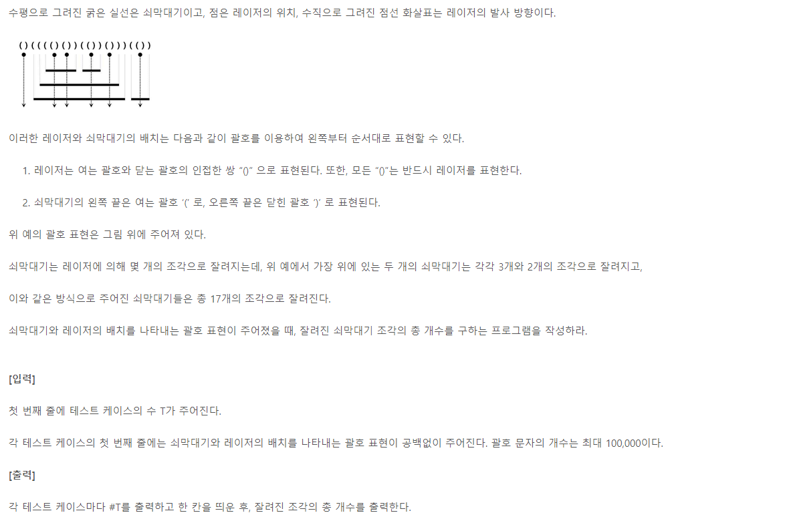
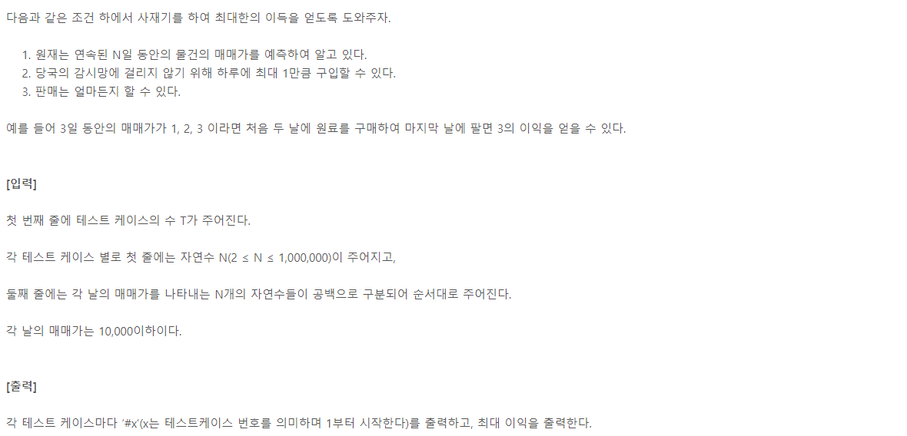
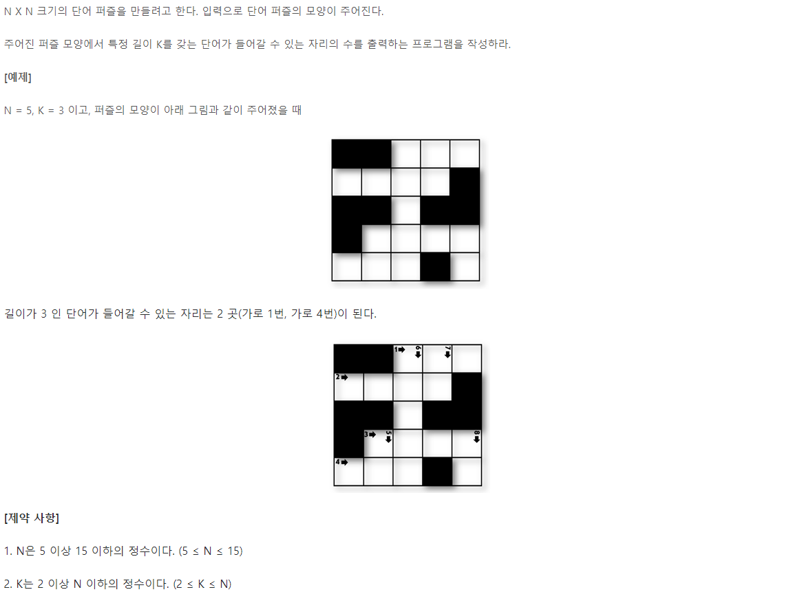
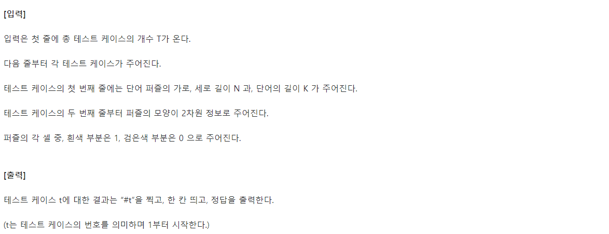
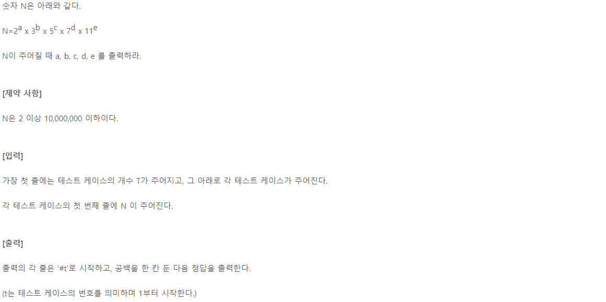
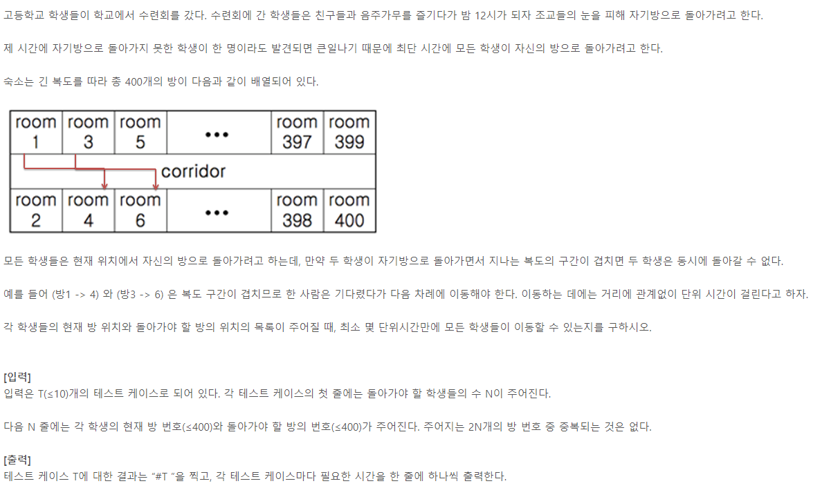
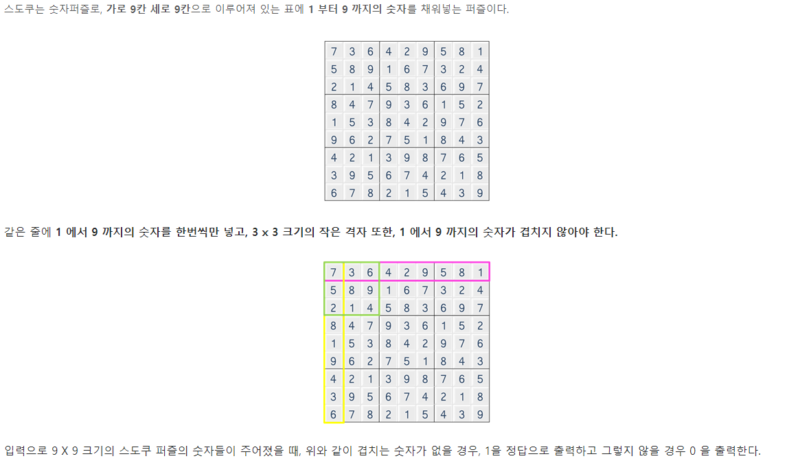
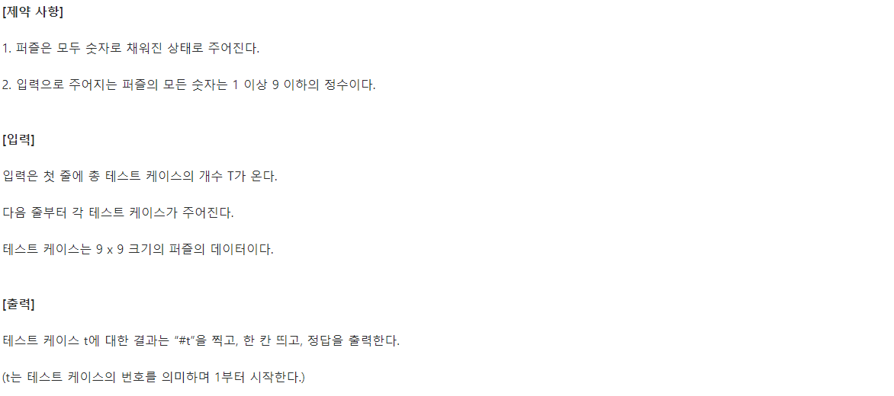

# SWEA-5432



- 최초 이중 for 문으로 풀었을 때는 시간제한을 빠져나올 수 없었던 문제
- cnt 를 이용한 논리로 해결

```python
# 쇠막대 자르기
T = int(input())
for tc in range(1, T+1):
    N = input()
    # 현재 레이저에 걸리는 쇠막대 수
    cnt = 0
    sol = 0

    for i in range(len(N)):
        # ( 만나면 쇠막대 생성
        if N[i] == '(':
            cnt += 1
        # ) 만났는데
        else:
            # 레이저였다면
            if N[i-1] == '(':
                # 쇠막대 아니었으니 하나 빼주고
                cnt -= 1
                # 중첩되어 있는 만큼 조각 생김
                sol += cnt
            # 레이저가 아니면
            else:
                # 쇠막대 소멸
                cnt -= 1
                # 쇠막대 끄트머리 세주기
                sol += 1
                
    print(f'#{tc} {sol}')
```


# SWEA-1859



```python
# 백만장자 프로젝트
import sys
sys.stdin = open('input.txt')

# Max 값의 인덱스 반환
def myMax(lst):
    max_idx = None
    max_val = 0
    for i in range(len(lst)):
        if max_val < lst[i]:
            max_val = lst[i]
            max_idx = i
    return max_idx

T = int(input())
for tc in range(1, T+1):
    # N 일동안 매매
    N = int(input())
    # 매매가 리스트
    lst = list(map(int, input().split()))
    
    total = 0

    # lst 에 아무것도 없을 때까지 반복
    while len(lst) > 0:
        # lst 에서 Max 값의 idx 저장
        high_idx = myMax(lst)
        # 최고점까지 구간 분리
        temp = lst[0:high_idx+1]
        # 해당 구간에서 취할 수 있는 이익 계산
        total += (len(temp)-1)*temp[-1] - sum(temp[:-1])
        # lst 에는 분리해낸 구간 이후를 재할당
        lst = lst[high_idx+1:]

    print(f'#{tc} {total}')
```


# SWEA-1979





```python
T = int(input())
for tc in range(1, T+1):
    N, K = map(int, input().split())
    # NxN 배열 입력, 우측과 하단 끝에 0 배치
    arr = [list(map(int, input().split())) + [0] for _ in range(N)]
    arr.append([0]*(N+1))

    print(arr)
    # 결과
    sol = 0

    # 행 검사
    for i in range(N+1):
        cnt = 0
        for j in range(N+1):
            # 1 을 만나면 길이(cnt) +1
            if arr[i][j] == 1:
                cnt += 1
            # 0 을 만나면 길이가 K 와 같은지 확인, cnt 초기화
            else:
                if cnt == K:
                    sol += 1
                cnt = 0
    
    # 열 검사
    for j in range(N+1):
        cnt = 0
        for i in range(N+1):
            # 1 을 만나면 길이(cnt) +1
            if arr[i][j] == 1:
                cnt += 1
            # 0 을 만나면 길이가 K 와 같은지 확인, cnt 초기화
            else:
                if cnt == K:
                    sol += 1
                cnt = 0
    
    print(f'#{tc} {sol}')
```


# SWEA-1945



```python
# 간단한 소인수분해
T = int(input())
for tc in range(1, T+1):
    N = int(input())
    # 소인수분해할 인수들
    lst = [2, 3, 5, 7, 11]
    cnts = [0] * 5

    for i in range(len(lst)):
        # 각 인수로 나누어떨어질 때
        while N % lst[i] == 0:
            # cnts 에 저장
            cnts[i] += 1
            # 나눈 몫을 N 에 재할당
            N //= lst[i]

    print(f'#{tc}', end=' ')
    print(' '.join(map(str, cnts)))
```


# SWEA-4408



```python
# 자기방으로 돌아가기
def myMax(lst):
    max_val = 0
    for i in lst:
        if i > max_val:
            max_val = i
    return max_val

# 홀수방만 만들어
rooms_odd = [i for i in range(1, 400, 2)]

T = int(input())
for tc in range(1, T+1):
    # 돌아갈 학생수
    N = int(input())

    lst = [list(map(int, input().split())) for _ in range(N)]
    cnts = [0] * 200
    
    # 짝수 번째 방 번호에서 -1 해주면 홀수 번째와 idx(방 위치) 동일
    for i in lst:
        for j in range(2):
            if i[j] % 2 == 0:
                i[j] -= 1

        # 도착하는 방번호가 크도록 설정
        if i[0] > i[1]:
            i[0], i[1] = i[1], i[0]

        # 방 번호의 idx(위치)를 추출, 해당 위치에 대해 카운트
        start_idx = rooms_odd.index(i[0])
        end_idx = rooms_odd.index(i[1])
        for k in range(start_idx, end_idx+1):
            cnts[k] += 1

    print(f'#{tc} {myMax(cnts)}')
```


# SWEA - 1974





```python
# 스도쿠 검증

# 행 검증
def isRow(arr):
    is_true = [0] * 9

    for i in range(9):
        # 숫자에 해당하는 칸(인덱스)에 카운트
        cnts = [0] * 10
        for j in range(9):
            cnts[arr[i][j]] += 1

        # 숫자별로 전부 1이 채워졌으면 그 행은 검증 완료
        if all(cnts[1:10]):
            is_true[i] += 1
    
    # 모든 행이 완료라면 True
    if all(is_true):
        return True
    else:
        return False

# i, j만 바꾼 열 검증
def isCol(arr):
    is_true = [0] * 9

    for j in range(9):
        # 숫자에 해당하는 칸(인덱스)에 카운트
        cnts = [0] * 10
        for i in range(9):
            cnts[arr[i][j]] += 1

        # 숫자별로 전부 1이 채워졌으면 그 행은 검증 완료
        if all(cnts[1:10]):
            is_true[j] += 1
    
    # 모든 행이 완료라면 True
    if all(is_true):
        return True
    else:
        return False

# 3x3 칸 검증
def isBlock(arr):
    dr = [0, 0, 0, 1, 1, 1, 2, 2, 2]
    dc = [0, 1, 2, 0, 1, 2, 0, 1, 2]
    is_true = 0
    # i,j 는 0, 3, 6
    for i in range(0, 9, 3):
        for j in range(0, 9, 3):
            cnts = [0] * 10
            # 델타를 이용해 3x3 확인
            for k in range(9):
                cnts[arr[i+dr[k]][j+dc[k]]] += 1
            if all(cnts[1:10]):
                is_true += 1
    
    # 모두 True라 9가 되면
    if is_true == 9:
        return True
    else:
        return False


T = int(input())
for tc in range(1,1+T):
    # 9x9 퍼즐
    arr = [list(map(int, input().split())) for _ in range(9)]

    rlt = int(isRow(arr) and isCol(arr) and isBlock(arr))

    print(f'#{tc} {rlt}')
```
