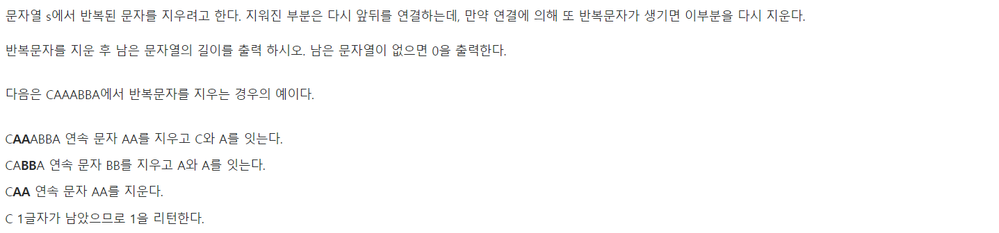
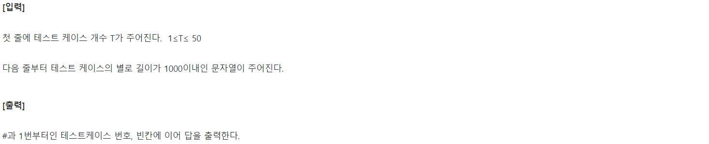
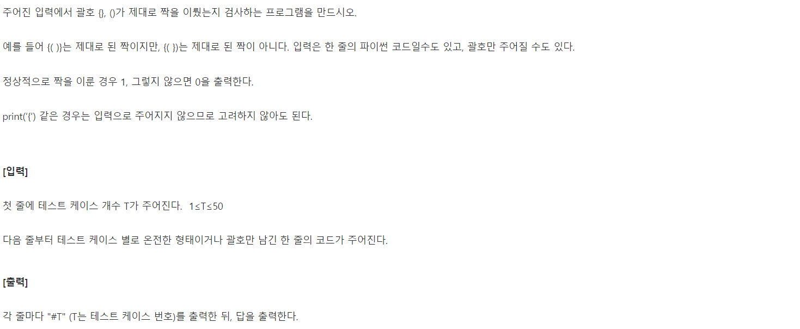
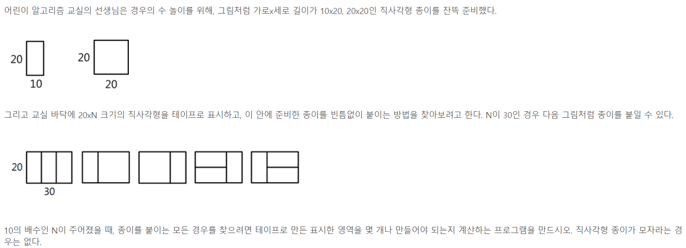
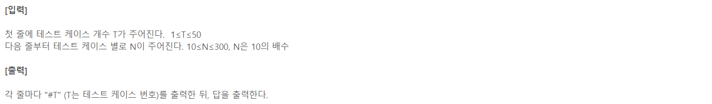

# 1. SWEA-4873





```python
def erase(S):
    # 첫 문자를 비교할 때 에러를 방지하기 위해 항목을 하나 채움
    stack = [0]
    # 순서대로 넣다가
    for i in S:
        # 방금 들어간 애랑 지금 넣을 애랑 같으면
        if i == stack[-1]:
            # 이전에 있던 애도 들어내
            stack.pop()
        else:
            stack.append(i)

    # 처음에 임시로 넣은 애(인덱스 0) 다시 빼고
    stack.pop(0)
    return len(stack)

T = int(input())
for tc in range(1, T+1):
    S = input()
    print(f'#{tc} {erase(S)}')
```


# 2. SWEA-4866



```python
def check(S):
    # 바로 stack[-1]과 비교하면 오류나니 미리 채워넣기
    stack = [0]
    for i in S:
        # 여는 괄호 만나면 스택 쌓기
        if i == '(' or i == '{':
            stack.append(i)
        # 닫는 괄호 만났을 때 바로 전에 넣은것이 여는 괄호면
        # 쌍으로 삭제
        if i == ')':
            if stack[-1] == '(':
                stack.pop()
            else:
                return False
        if i == '}':
            if stack[-1] == '{':
                stack.pop()
            else:
                return False

    # 미리 채워넣었던 것 삭제
    stack.pop(0)

    if len(stack) == 0:
        return True
    else:
        return False


T = int(input())
for tc in range(1, T+1):
    S = input()
    print(f'#{tc} {int(check(S))}')
```


# 3. SWEA-4869





```python
def cases():
    global memo
    # 2단계 전 * 2 + 1단계 전
    memo.append(memo[-2]*2 + memo[-1])

T = int(input())
for tc in range(1, T+1):
    N = int(input())
    # N은 10일 때 1, 20일 때 3
    memo = [1, 3]
    # 10, 20일 때가 주어져 있으니 30부터 적용
    # 추가분만큼 반복하여 memo를 늘려나감
    for _ in range(N//10-2):
        cases()

    print(f'#{tc} {memo[N//10 - 1]}')
```

