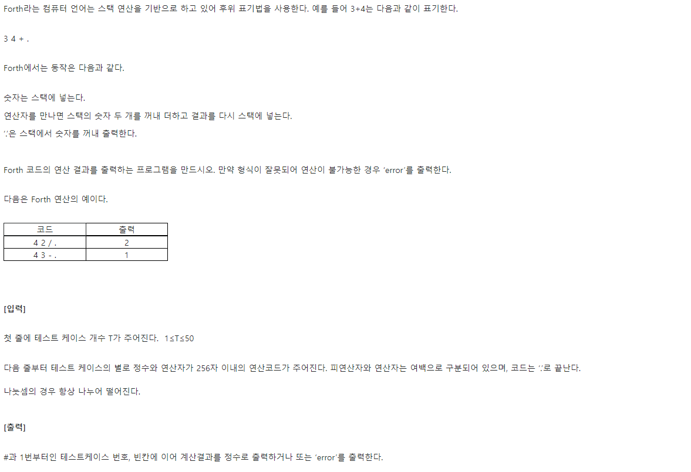
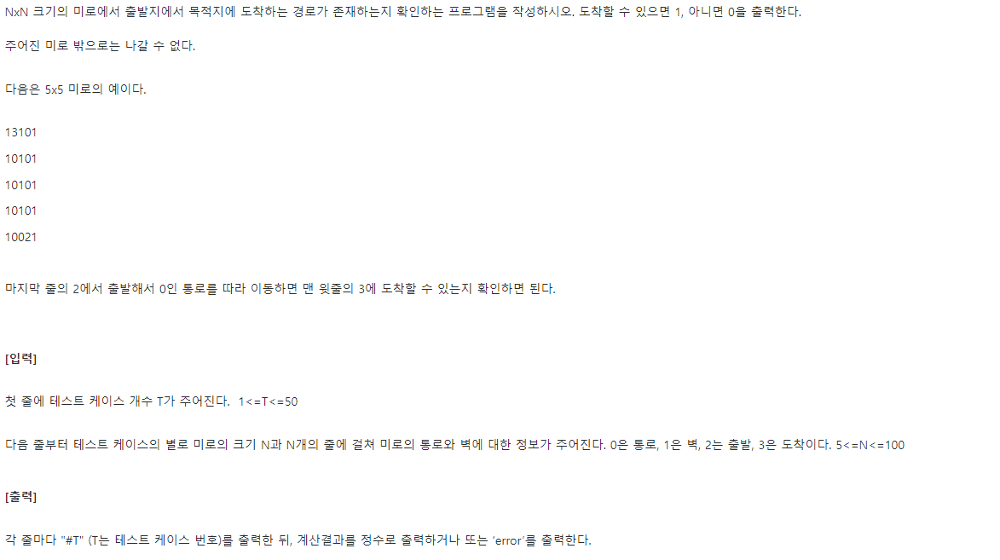
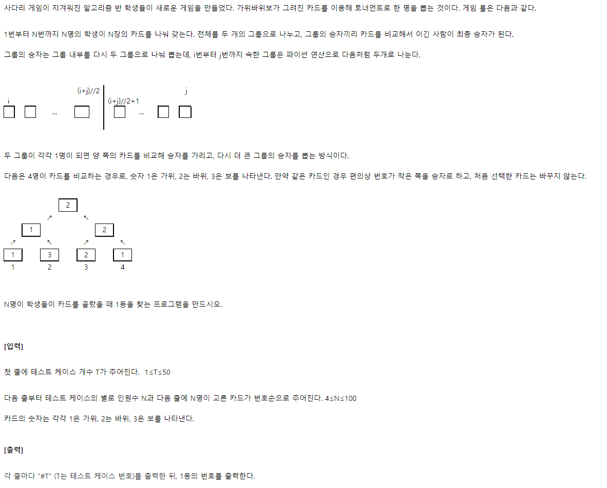
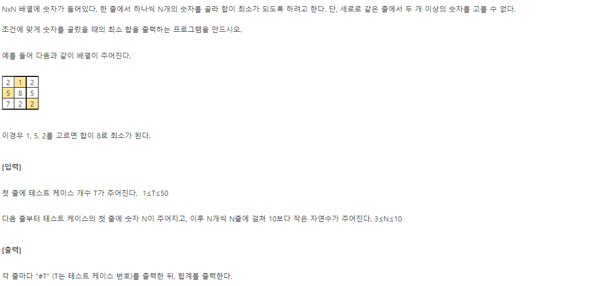
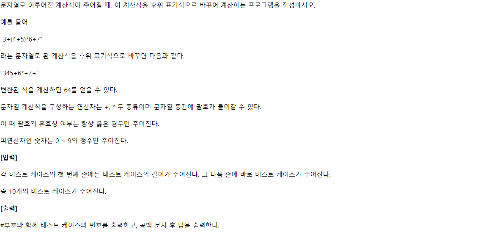

# 1. SWEA-4874



```python
T = int(input())
for tc in range(1, T+1):
    stack = []
    code = input().split()

    print(f'#{tc}', end=' ')

    try:
        for i in code:                          # 주어진 코드를 순회하면서
            if i == '.':                        # 마침표 만나면 종료
                if len(stack) > 1:              # 스택에 2개이상의 숫자 남았다면
                    print('error')              # 잘못된 코드
                    break
                else:
                    print(stack.pop())          # 아니라면 top 출력 후 종료
                    break
            elif i.isdigit():                   # 숫자일 경우 push
                stack.append(int(i))
            else:                               # 연산자일 경우
                p2 = stack.pop()                # 먼저 pop 되는 숫자가 연산 뒤에 적용
                p1 = stack.pop()
                if i == '+':                    # 연산결과를 push
                    stack.append(p1 + p2)
                elif i == '*':
                    stack.append(p1 * p2)
                elif i == '-':
                    stack.append(p1 - p2)
                elif i == '/':
                    stack.append(int(p1 / p2))  # float 결과 방지 (나누어떨어짐)

    # 연산이 불가능할 경우 error 출력
    except:
        print('error')

```

https://swexpertacademy.com/main/learn/course/subjectDetail.do?courseId=AVuPDN86AAXw5UW6&subjectId=AWOVIc7KqfQDFAWg#


# 2. SWEA-4875



```python
# 2에서 출발해 3에 도착할 수 있는가
# 출발지 도착지 위치 찾는 함수
def point(arr):
    start = None
    end = None

    for r in range(len(arr)):
        for c in range(len(arr[r])):
            if arr[r][c] == 2:          # 2 출발지
                arr[r][c] = 0           # 확인했으면 통로로 바꿔 지나갈 수 있게
                start = [r, c]
            if arr[r][c] == 3:
                arr[r][c] = 0
                end = [r, c]

    return start, end


T = int(input())
for tc in range(1, T+1):
    N = int(input())
    arr = [list(map(int, input())) for _ in range(N)]

    start_idx, end_idx = point(arr)
    print(f'#{tc}', end=' ')

    # 상 하 좌 우
    dr = [-1, 1, 0, 0]
    dc = [0, 0, -1, 1]

    # stack(현재 경로)과 visit(방문 좌표)은 시작 위치를 담고 있음
    stack = [start_idx]
    visit = [start_idx]

    while True:
        # 더이상 갈데가 없으면 break
        if not stack:
            print(0)
            break

        # 도착지에 도착하면 break
        elif stack[-1] == end_idx:
            print(1)
            break


        else:
            # 현위치에서 사방 확인
            for k in range(4):
                temp_r = stack[-1][0]+dr[k]
                temp_c = stack[-1][1]+dc[k]
                # 움직일 칸이 인덱스를 벗어나면 넘어가
                if temp_r < 0 or temp_r > N-1 or temp_c < 0 or temp_c > N-1:
                    continue
                # 통로가 있다면, 그리고 안 가본데라면
                elif arr[temp_r][temp_c] == 0 and [temp_r, temp_c] not in visit:
                    # 가자
                    stack.append([temp_r, temp_c])
                    visit.append([temp_r, temp_c])
                    break
            # 벽이나 주변에 가본 통로밖에 없다면
            else:
                # 되돌아가기
                stack.pop()
```

https://swexpertacademy.com/main/learn/course/subjectDetail.do?courseId=AVuPDN86AAXw5UW6&subjectId=AWOVIc7KqfQDFAWg#


# 3. SWEA-4880



```python
def rsp(a, b):
    # 비겼을 때는 번호가 작은 쪽 반환
    if students[a - 1] == students[b - 1]:
        return a
    # 가위바위보 이긴 쪽의 인덱스 반환
    elif students[a-1] == 1 and students[b-1] == 3:
        return a
    elif students[a-1] == 3 and students[b-1] == 1:
        return b
    elif students[a-1] > students[b-1]:
        return a
    elif students[a-1] < students[b-1]:
        return b

def tor(start, end):
    # 혼자 남을 때
    if end == start:
        # 그 학생 번호 저장
        return start
    else:
        left = tor(start, (start+end)//2)
        right = tor((start+end)//2+1, end)
        return rsp(left, right)


T = int(input())
for tc in range(1, 1+T):
    N = int(input())
    students = list(map(int, input().split()))

    winner = tor(1, N)
    print(f'#{tc} {winner}')
```

https://swexpertacademy.com/main/learn/course/subjectDetail.do?courseId=AVuPDN86AAXw5UW6&subjectId=AWOVIc7KqfQDFAWg#


# 4. SWEA-4881



```python
def arrMin(r):
    global each_sum
    global rlt
    # 이번 합계가 결과보다 커지면 더 돌 필요없어
    if rlt < each_sum:
        return

    # 끝까지 갔으면 종료
    if r == N:
        # 이번 합이 결과보다 작을 때는 덮어씌우기
        if each_sum < rlt:
            rlt = each_sum
        return

    # 열 순회
    for c in range(N):
        # 해당 열 선택 안했으면
        if not select[c]:
            # 선택했다치고
            select[c] = 1
            each_sum += arr[r][c]
            # 다음 행 진행해봐
            arrMin(r+1)
            # 다시 안한걸로 해
            select[c] = 0
            each_sum -= arr[r][c]

T = int(input())
for tc in range(1, T+1):
    N = int(input())
    arr =[list(map(int, input().split())) for _ in range(N)]

    # 선택한 column 은 1로 표시
    select = [0] * N

    rlt = 1000
    each_sum = 0

    # 행 인덱스 0부터 시작
    arrMin(0)

    print(f'#{tc} {rlt}')
```

https://swexpertacademy.com/main/learn/course/subjectDetail.do?courseId=AVuPDN86AAXw5UW6&subjectId=AWOVIc7KqfQDFAWg#


# 5. SWEA-1224



```python
# 계산기 3
T = 10
for tc in range(1, T+1):
    # 후위표기식 변환
    N = int(input())
    S = list(input())
    stack = []
    rlt = ''

    icp = {'*': 2, '+': 1, '(': 3}  # 넣을때
    isp = {'*': 2, '+': 1, '(': 0}  # 스택안

    for i in S:
        # 숫자라면 바로 넣고
        if i.isdigit():
            rlt += i
        # 스택이 빈 경우
        elif not stack:
            stack.append(i)

        # 닫는 괄호를 만나면
        elif i == ')':
            # 여는 괄호를 꺼낼 때까지 이어붙이기
            while stack[-1] != '(':
                rlt += stack.pop()
            stack.pop()

        # 우선순위가 큰게 들어올 때
        elif icp[i] > isp[stack[-1]]:
            stack.append(i)

        else:
            # 우선순위가 작은게 들어올 때
            while icp[i] <= isp[stack[-1]]:
                rlt += stack.pop()
            stack.append(i)

    # 남은 스택이 있다면 전부 붙이기
    while stack:
        temp = stack.pop()
        if temp != '(':
            rlt += temp

    # ------- 후미표기식 이용해 계산 --------
    nums = []

    for j in rlt:
        # 숫자라면 바로 넣기
        if j.isdigit():
            nums.append(int(j))
        # 연산자라면
        elif j == '+':
            p2 = nums.pop()
            p1 = nums.pop()
            nums.append(p1 + p2)
        elif j == '*':
            p2 = nums.pop()
            p1 = nums.pop()
            nums.append(p1 * p2)

    print(f'#{tc} {nums[0]}')
```

https://swexpertacademy.com/main/code/problem/problemDetail.do?contestProbId=AV14tDX6AFgCFAYD