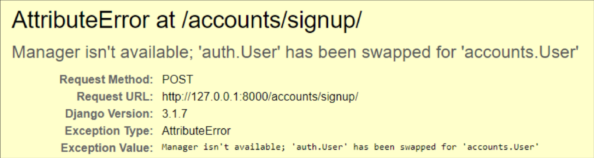

# Django Authentication System

> Django 인증 시스템
>
> 인증(Authentication)과 권한(Authorization)을 함께 처리함
>
> - 인증 : 사용자가 누구인지 확인
> - 권한 : 인증된 사용자가 할 수 있는 작업을 결정
>
> 내부적으로 accounts라는 이름으로 관리되어 앱이름을 accounts로 지정하는 것을 권장

```python
# settings.py에 기본적으로 추가되어있음

INSTALLED_APPS = [
    ...,
    'django.contrib.auth',			# 인증 프레임워크의 핵심과 기본 모델을 포함
    'django.contrib.contenttypes',	# 사용자가 생성한 모델과 권한을 연결
    ...,
]
```

<br>

---

<br>

# 쿠키와 세션

### HTTP

> 웹에서 여러 자원, 데이터를 가져오는 일종의 규칙(프로토콜)
>
> 특징
>
> - 비연결지향 : 요청과 응답이 이루어진 후 연결은 끊김
> - 무상태 : 연결이 끊기면 통신도 끝나며 정보가 유지되지 않음


### 쿠키

> 서버가 사용자에게 전송하는 작은 기록 정보 파일
>
> 로컬에 KEY-VALUE 형식으로 저장
>
> 동일한 서버에 재요청시 저장된 쿠키를 함께 전송

#### 쿠키의 사용목적

- 세션 관리 : 로그인, 아이디 자동 완성, 장바구니 ...
- 개인화 : 사용자 테마 등의 설정
- 트래킹 : 사용자 행동 기록 및 분석

#### 수명

- Session cookies : 현재 세션이 종료되면 삭제
- Persistent cookies : 지정된 기간이 지나면 삭제


### 세션

> 사이트와 사용자 사이의 상태를 유지시키는 것
>
> 클라이언트가 서버에 접속하면 서버는 session id를 발급하고 클라이언트는 받은 session id를 쿠키에 저장

```python
# Django에서는 settings.py의 MIDDLEWARE를 통해 관리
# database-backed sessions 저장 방식이 기본값
# 모든 것을 세션으로 관리하면 사용자가 많을 때 서버에 부하가 걸릴 수 있음

# 미들웨어: 요청과 응답의 사이에서 중개해주는 시스템
MIDDLEWARE = [
    ...,
    'django.contrib.sessions.middleware.SessionMiddleware',
    ...,
    'django.contrib.auth.middleware.AuthenticationMiddleware',
    ...,
]
```

<br>

---

<br>

# 로그인

> 인증에 관한 built-in forms 사용

```python
# accounts/urls.py

path('login/', views.login, name='login'),
```

```python
# accounts/views.py

from django.shortcuts import render, redirect
# view 함수 login와 혼동을 막기위해 이름을 붙여 사용
from django.contrib.auth import login as auth_login
from django.contrib.auth.forms import AuthenticationForm
from django.views.decorators.http import require_http_methods

# Create your views here.
@require_http_methods(['GET', 'POST'])
def login(request):
    if request.method == 'POST':
        # 요청과 요청의 정보가 순서대로 인자로 들어감
        form = AuthenticationForm(request, request.POST)
        if form.is_valid():
            # 세션의 user의 ID를 저장
            # get_user() 메서드를 이용하여 AuthenticationForm에서 user 정보를 가져올 수 있음
			# 유효성 검사를 통과했을 경우에만 user 정보 반환
            auth_login(request, form.get_user())
            return redirect('articles:index')
    else:
        form = AuthenticationForm()
    context = {'form': form,}
    return render(request, 'accounts/login.html', context)
```

```django
<!-- accounts/templates/accounts/login.html -->




  <h1>로그인</h1>
  <form action="" method="POST">
    
    {{ form.as_p }}
    <input type="submit">
  </form>

```


### 로그인 정보 출력

> context processors에서 자동으로 호출가능한 데이터 목록 제공

```python
# settings.py

# 기본으로 포함되어 있는 유저 정보
TEMPLATES = [
    {
        ...,
        'OPTIONS': {
            'context_processors': [
                ...,
                'django.contrib.auth.context_processors.auth',
            ]
        }
    }
]
```

```django
<!-- base.html -->

...
<!-- user는 context_processors에서 기본 제공하는 변수, 현재 로그인된 유저 정보 출력
로그인되지 않은 상태라면, 유저 이름은 AnonymousUser -->
<h3>Hello, {{ user }}</h3>
<a href="">Login</a>
...
```


<br>

---

<br>

# 로그아웃

```python
# accounts/urls.py

path('logout/', views.logout, name='logout'),
```

```python
# accounts/views.py

@require_POST
def logout(request):
    auth_logout(request)
    return redirect('articles:index')
```

```django
<!-- base.html -->

<form action="" method="POST">
    
    <input type="submit" value="Logout">
</form>
```


<br>

---

<br>

# 로그인 접근 제한

- `request.user.is_authenticated`: 사용자가 인증되었다면 True 반환

  - 권한과는 관련이 없으며, 활성화 상태나 유효한 세션 여부를 확인하지도 않음

- `@login_required`: 로그인되어 있지 않으면, `settings.LOGIN_URL`로 redirect시킴

  - 원래 가려던 경로는 `'next'` 파라미터에 저장, 로그인 완료 후 이동 가능

    ```python
    def login(request):
        if requrst.method == 'POST':
            form = AuthenticationForm(request, request.POST)
            if form.is_valid():
                auth_login(request, form.get_user())
                # next 파라미터에 저장해두었던 경로로 이동
                # 단, redirect는 GET방식으로 요청하기에, 
                # next 경로에 @requitre_POST가 붙어있다면 처리 불가
                return redirect(request.GET.get('next') or 'articles:index')
    ```

    

<br>

---

<br>

# 회원가입 (UserCreationForm)

> 새로운 user를 생성하는 ModelForm


### 필드

- username
- password1
- password2 (확인)

```python
# accounts/urls.py

path('signup/', views.signup, name='signup')
```

```python
# accounts/views.py

from django.contrib.auth.forms import UsercreationForm

def signup(request):
    if request.method == 'POST':
        form = UserCreationForm(request.POST)
        if form.is_valid():
            user = form.save()
            # 회원가입 후 자동로그인
            auth_login(request, user)
            return redirect('articles:index')
    else:
        form = UserCreationForm()
    context = {'form': form,}
    return render(request, 'accounts/signup.html', context)
```

```django
<!-- accounts/templates/accounts/signup.html -->




  <h1>회원가입</h1>
  <form action="" method="POST">
    
    {{ form.as_p }}
    <input type="submit">
  </form>

```


<br>

---

<br>

# 회원탈퇴

```python
# accounts/urls.py

path('delete/', views.delete, name='delete'),
```

```python
# accounts/views.py

from django.views.decorators.http import require_POST

@require_POST
def delete(request):
    if request.user.is_authenticated:
        # 유저 데이터 삭제(탈퇴)
        request.user.delete()
        # 탈퇴와 함께 로그아웃, 반드시 탈퇴 후 로그아웃 순
        auth_logout(request)
    return redirect('articles:index')
```

```django
<!-- base.html -->

<form action="" method="POST">
    
    <input type="submit" value="회원탈퇴">
</form>
```


<br>

---

<br>

# 회원정보 수정 (UserChangeForm)

> 사용자의 정보 및 권한을 변경하기 위한 ModelForm
>
> 일반 사용자가 접근해서는 안될 fields가 form으로 노출되므로, 반드시 이를 상속한 클래스로 커스텀해 사용

```python
# accounts/forms.py

from django.contrib.auth.forms import UserChangeForm
from django.contrib.auth import get_user_model

class CustomUserChangeForm(UserChangeForm):
    
    class Meta:
        # 유저 모델을 가져와 모델로 지정
        model = get_user_model()
        fields = ('email', 'first_name', 'last_name',)
```

```python
# accounts/urls.py

path('update/', views.update, name='update'),
```

```python
# accounts/views.py

from django.contrib.auth.decorators import login_required
from .forms import CustomUserChangeForm

@login_required
@require_http_methods(['GET', 'POST'])
def update(request):
    if request.method == 'POST':
        form = CustomUserChangeForm(request.POST, instance=request.user)
        if form.is_valid():
            form.save()
            return redirect('articles:index')
    else:
        form = CustomUserChangeForm(instance=request.user)
    context = {
        'form': form,
    }
    return render(request, 'accounts/update.html', context)
```

```django
<!-- accounts/update.html -->




	<h1>회원정보 수정</h1>
	<form action="" method="POST">
        
        {{ form.as_p }}
        <input type="submit">
	</form>

```


<br>

---

<br>

# 비밀번호 변경 (PasswordChangeForm)

> 사용자가 비밀번호를 변경할 수 있도록 하는 Form
>
> 기존 비밀번호를 입력하지 않아도 변경이 가능한 SetPasswordForm을 상속받아
>
> 기존 비밀번호를 입력해야 비밀번호 변경이 가능하도록 만든 서브 클래스

```python
# accounts/urls.py

path('password/', views.change_password, name='change_password'),
```

```python
# accounts/views.py

from django.contrib.auth import update_session_auth_hash
from django.contrib.auth.forms import PasswordChangeForm


@login_required
@require_http_methods(['GET', 'POST'])
def change_password(request):
    if request.method == 'POST':
        form = PasswordChangeForm(request.user, request.POST)
        if form.is_valid():
            form.save()
            # 비밀번호를 변경할 경우 세션이 바뀌어 사용자는 자동으로 로그아웃
            # 업데이트된 사용자 정보를 가져오고, 세션을 업데이트해주는 함수
            update_session_auth_hash(request, form.user)
            return redirect('articles:index')
    else:
        form = PasswordChangeForm(request.user)
    context = {
        'form': form,
    }
    return render(request, 'accounts/change_password.html', context)
```

```django
<!-- accounts/change_password.html -->




	<h1>비밀번호 변경</h1>
	<form action="" method="POST">
        
        {{ form.as_p }}
        <input type="submit">
	</form>

```


<br>

---

<br>


# User모델 대체하기

> Django는 내장 User 모델을 재정의(override)할 수 있도록 함
>
> 기본 사용자 모델이 충분하더라고 커스텀 모델을 사용하는 것을 권장
>
> 첫 마이그레이션 전에 커스텀 모델 작업을 마쳐야함
>
> db.sqlite3와 migrations를 삭제해 마이그레이션 초기화 가능

```python
# accounts/models.py

# AbstractUser을 상속한 커스텀 모델 생성
from django.contrib.auth.models import AbstractUser

class User(AbstractUser):
    pass
```

```python
# settings.py

# 커스텀 유저 모델 지정
# default: auth.User
# 프로젝트가 진행되는 동안 변경할 수 없음
AUTH_USER_MODEL = 'accounts.User'
```


### UserCreationForm, UserChangeForm

> UserCreationForm과 UserChangeForm는 기존 내장 User 모델을 사용하기 때문에,
>
> User모델을 대체해준다면 UserCreationForm, UserChangeForm도 커스텀해서 사용해야함
>
> 커스텀하지 않았을 때 다음과 같은 오류 발생



```python
# accounts/forms.py

class CustomUserCreationForm(UserCreationForm):

    class Meta(UserCreationForm.Meta):
        # User 모델은 직접 참조하지 않고 get_user_model() 사용
        model = get_user_model()
        fields = UserCreationForm.Meta.fields + ('email',)
```

