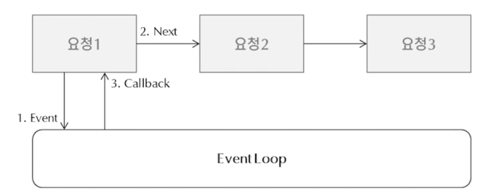

# Node.js

> Chrome V8 JavaScript 엔진으로 빌드된 JavaScript 런타임
>
> 서버가 아닌, 서버와 같은 네트워크 프로그램을 만들기 위한 SW 플랫폼


### Why

JavaScript는 브라우저 안에서 동작하기 때문에, 브라우저 없이 실행하려면 별도의 실행환경이 필요

Node.js는 JavaScript 실행환경에서 서버 프로그램을 만들 수 있음


### 특징

- 단일 쓰레드(Single Thread), 이벤트 루프(Event Loop) 기반

  

- 비동기 Non-Blocking I/O 처리
- 이벤트 발생시 서버에 메시지 형태로 전달


### 장점

- JavaScript를 이용해서 서버를 만들 수 있다.
- npm (node package manager)을 통한 다양한 모듈 제공


### 단점

- 비동기 방식으로 이벤트를 보내고 응답을 처리하기 때문에, 순차적으로 실행하는 방식과는 차이가 있다.
- 단일 쓰레드(Single Thread)로, 한 작업이 오해 걸리는 서비스의 경우에는 사용 불가


### Node.js가 유용할 때

- 간단한 서버 로직
- 빠른 응답시간을 요구
- 빠른 개발을 요구
- 비동기 방식에 어울리는 스트리밍 서비스, 채팅 서비스 등을 개발


<br>

---

<br>


# require()

> Node.js에서 외부 모듈을 가져오는 메서드
>
> node가 local object에 추가한 메서드

```js
// require를 이용해 외부 모듈 가져오기
const foo = require('파일 경로');
```

