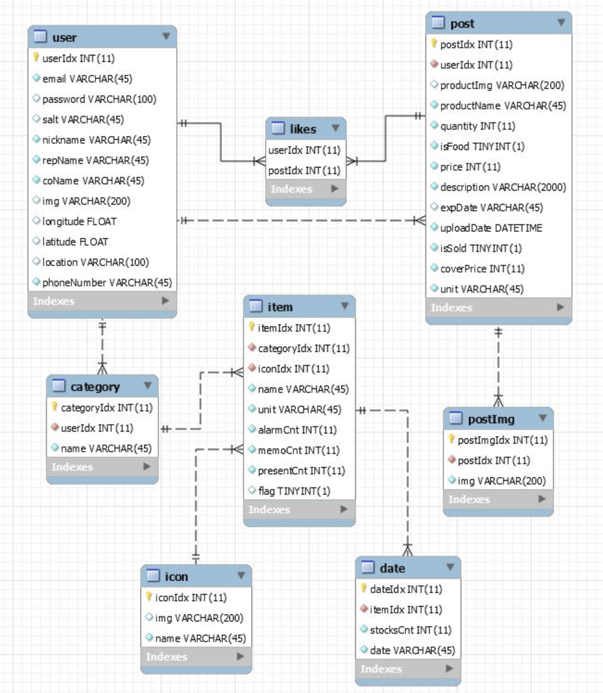
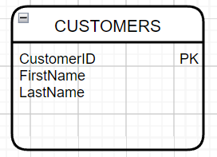
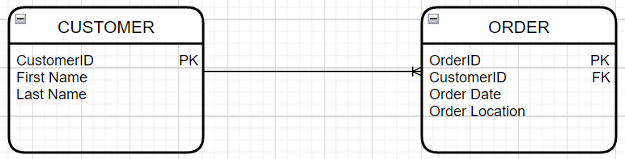
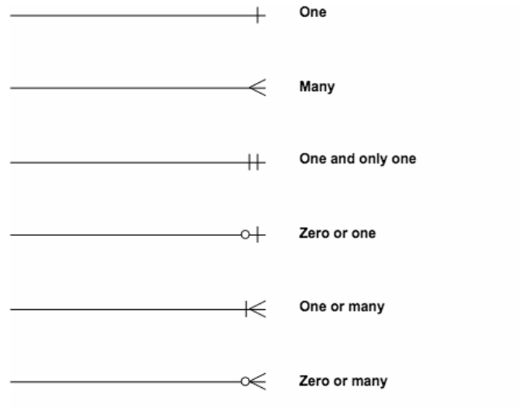

# Entity Relationship Diagram (ERD)

### 정의

시스템의 Entity가 무엇이 있는지, 어떤 Relationship이 있는지를 나타내는 프로그램

### 역할

데이터베이스를 설계할 때 전체 데이터베이스의 구조를 먼저 잡음으로써 테이블의 형태과 관계를 명확히 해주고,

데이터베이스를 사용하거나 수정할 때도 쉽게 구조를 파악할 수 있어 효율성이 증가한다.

# Entity

### 특징

- Entity의 이름은 단수형이고 ERD 내에서 유일해야 한다. 대문자로 표기한다.
- 하나 이상의 식별자(Unique Identifier)를 갖는다.
- Entity와 Attribute의 이름은 같으면 안된다.

# Relationship

### 정의

두 Entity 사이의 관계를 나타낸 선

### 특징

- Cardinality (참여자의 수)

