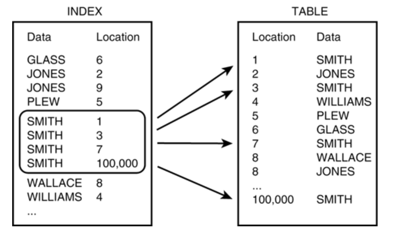

# Index

 

### 정의

> "인덱스를 탄다"
>
> "책에 있는 목차"

데이터베이스 테이블에 대한 검색 성능의 속도를 높여주는 자료 구조

 

### 사용하는 이유

1. Where 절 효율성

   데이터가 쌓이게 되면 테이블 레코드는 순서 없이 뒤죽박죽으로 저장되는데, 이런 상태에서는 특정 조건에 맞는 데이터들을 찾아낼 때도 처음부터 끝까지 모든 데이터와 비교해야한다(Full Table Scan). 그러나 정렬된 인덱스 테이블을 갖고 있으면 보다 빠르게 비교를 마칠 수 있다.

2. Order by 절 효율성

   인덱스는 이미 정렬되어 있는 테이블이기에, 정렬된 레코드를 찾을 때마다 부하가 큰 정렬 처리를 할 필요가 없다.

3. MIN, MAX 효율성

   마찬가지로 정렬이 되어 있는 테이블이 있기에 레코드의 처음과 끝 값을 비교하면 된다.

 

### 단점

- 항상 정렬된 상태를 유지해야 하므로 값이 추가되거나 바뀔 때 INDEX 테이블에 재정렬이 필요하다.
  - 데이터의 인덱스를 제거하는 것이 아니라 "사용하지 않음"으로 처리하고 남겨두기 때문에 수정 작업이 많은 경우 실제 데이터에 비해 인덱스가 과도하게 커진다.

- 하나의 데이터 변경에 두 개의 테이블(원본과 INDEX)에 수정사항이 발생한다.
- 전체 데이터의 10~15% 이상을 처리하는 작업을 할 때 오히려 성능이 낮아질 수 있다.
  - 나이, 성별 같이 값의 범위가 적을 경우, 인덱스에서 다시 한번 많은 데이터를 조회해야 하기 때문에 비효율적이다.

- 데이터 형식에 따라서도 성능이 낮아질 수 있다.

 

---

 

# Index의 자료구조

> 여러 자료구조를 이용해서 구현할 수 있고, 대표적으로 해시 테이블과 B+ Tree

### 해시 테이블 (Hash Table)

key-value를 한 쌍으로 데이터를 저장하는 자료구조. 

해시테이블을 이용한다면 인덱스는 (key, value) = (컬럼 값, 데이터 위치)로 구현하게 된다.

해시테이블의 데이터들은 정렬되어 있지않아 부등호 연산을 빠르게 처리할 수 없다.

따라서 부등호 연산을 주로 사용하는 인덱스에서는 잘 사용되지 않는다.

### B+ Tree

