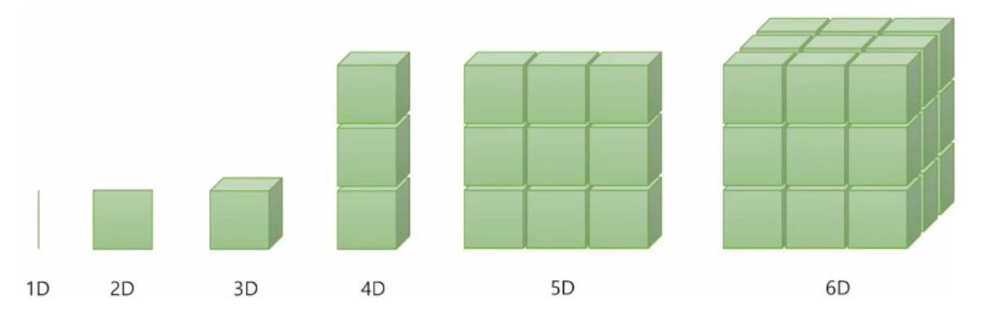
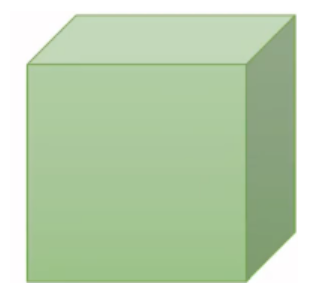

## Vector, Matrix and Tensor

### 1) 텐서의 개념



- 0차원: 스칼라(Scalar)

- 1차원: 벡터(Vector)

- 2차원: 행렬(Matrix)

- 3차원: 텐서(Tensor)

> 데이터 사이언스 분야에 한정해, 백터를 1차원 텐서, 행렬을 2차원 텐서라 표현하는 등 텐서를 행렬 또는 배열을 뜻하는 용어로 사용하기도 한다.

<br>

### 2) 텐서의 크기 (PyTorch Tensor Shape Convention)

#### 2D Tensor (Typical Simple Setting)


**|t| = (Batch size, dim)**

**batch size**: 행의 크기, 한번에 처리하는 데이터의 개수

**dim**: 열의 크기, 데이터 하나의 크기

```python
# dim = 3
# batch size = 5

[[1, 2, 3],
[2, 3, 4],
[3, 4, 5],
[4, 5, 6],
[5, 6, 7]]
```

<br>

#### 3D Tensor (Typical Computer Vision)



**|t| = (batch size, width, height)**

비전 분야(이미지, 영상처리)의 3차원 텐서

이미지는 가로(**width**), 세로(**height**)가 존재

<br>

#### 3D Tensor (Typical Natural Language Processing)


**|t| = (batch size, length, dim)**

자연어 처리의 3차원 텐서

**length**: 자연어에는 문장 길이라는 차원이 추가 (=단어 개수)

**dim**: 각 단어를 벡터로 변환했을 때 차원의 수

```python
# batch size = 4
# length = 2
# dim = 3

# 사과를 좋아해, 바나나를 좋아해, 사과를 싫어해, 바나나를 싫어해
# '사과를' = [0.3, 0.5, 0.1]
# '바나나를' = [0.3, 0.5, 0.2]
# '좋아해' = [0.7, 0.6, 0.5]
# '싫어해' = [0.5, 0.6, 0.7]
[[[0.3, 0.5, 0.1], [0.7, 0.6, 0.5]],
 [[0.3, 0.5, 0.2], [0.7, 0.6, 0.5]],
 [[0.3, 0.5, 0.1], [0.5, 0.6, 0.7]],
 [[0.3, 0.5, 0.2], [0.5, 0.6, 0.7]]]
```


## 텐서 선언하기

#### Numpy

```python
import numpy as np

# 1차원
t = np.array([0., 1., 2., 3., 4., 5., 6.])
print(t.ndim)
print(t.shape)
print(t[:2])

# 출력결과
# 1
# (7,) -------------------> (7,)은 (1, 7)을 의미
# [0. 1.]

# 2차원
t = np.array([[1., 2., 3.], [4., 5., 6.], [7., 8., 9.], [10., 11., 12.]])
print(t.ndim)
print(t.shape)

# 출력결과
# 2
# (4, 3)
```

<br>

#### PyTorch

```python
import torch

# 1차원
t = torch.FloatTensor([0., 1., 2., 3., 4., 5., 6.])
print(t.dim())
print(t.shape)
print(t.size())	# size()는 tensor 객체 내의 shape 속성을 반환하는 메서드
print(t[:2])

# 출력결과
# 1
# torch.Size([7])
# torch.Size([7])
# tensor([0., 1.])

# 2차원
t = torch.FloatTensor([[1., 2., 3.],
                       [4., 5., 6.],
                       [7., 8., 9.],
                       [10., 11., 12.]
                      ])
print(t.dim())
print(t.size())

# 출력결과
# 2
# torch.Size([4, 3])
```

