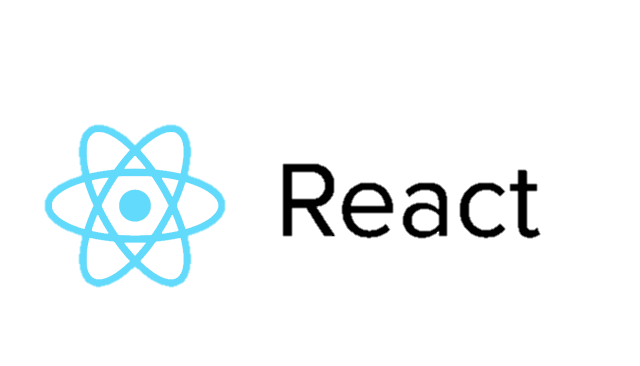

# React의 배경

- 페이스북이 만든 프론트엔드 프레임워크
  - 페이스북의 지속적인 사용과 투자
- 전세계 규모 상위 1만개 웹사이트 중 약 44%가 사용
- 에어비앤비, 인스타그램, 페이스북, 넷플릭스...
  - 특히나 웹사이트의 비중이 높은 회사
- Javascript 기반의 거대한 커뮤니티 보유
- React Native 등 생태계 확장


# Why React?

- interactive한 웹사이트 제작
- HTML 태그를 직접 작성할 필요 없이, javascript만으로 요소를 생성하고 배치할 수 있음
- vanilla javascript에서의 복잡한 이벤트 핸들링 과정을 간단하게 축약할 수 있음


# 이벤트 핸들링

```react
<!DOCTYPE html>
<html>
  <body>
    <div id="root"></div>
  </body>
  <!-- import react -->
  <script src="https://unpkg.com/react@17/umd/react.development.js"></script>
  <!-- import react-dom: React element들을 HTML body에 옮겨주는 역할 -->
  <script src="https://unpkg.com/react-dom@17/umd/react-dom.development.js"></script>
    
  <script>
    // HTML에 반영할 위치를 선택
    const root = document.querySelector('#root');
	// Title이라는 HTML 엘리먼트 생성
    // createElement >> 첫번째 인자: 태그 종류, 두번째 인자: property, 세번째 인자: content
    const Title = React.createElement("h3", {
      id: "title", 
      onMouseEnter: () => console.log("mouse enter")
    }, "Hello I'm a title");
    // 생성한 Title을 HTML의 root 안에 배치
    ReactDOM.render(Title, root);
  </script>
</html>
```

- `root`를 제외하곤 HTML의 엘리먼트를 선택자로 가져오거나,
- `addEventListener`를 쓸 일 없이 javascript 내에서 모든 작업을 마칠 수 있다.
