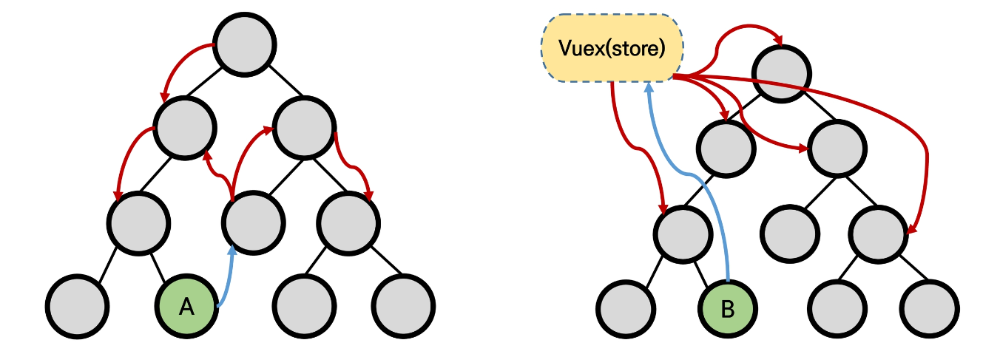

# Vuex 란?

>  Vuex는 Vue.js 애플리케이션에 대한 상태 관리 패턴 + 라이브러리입니다.
>
> 애플리케이션의 모든 컴포넌트에 대한 중앙 집중식 저장소 역할을 하며 예측 가능한 방식으로 상태를 변경할 수 있습니다.

기존의 Vue는 `Props`와 `$emit`, `EventBus`를 이용해 데이터를 주고 받음

이 때,  **컴포넌트의 깊이(Depth)가 깊어지거나** 여러 컴포넌트에서 **공통으로 사용하는 데이터가 많아진다면**, 데이터 교환이 복잡해진다.

따라서 데이터를 한 중앙관리소에서 모아 관리하고자 하는 것이 Vuex.



<br>

# Installation

- CDN

```javascript
// vue 뒤에 vuex 추가
<script src="/path/to/vue.js"></script>
<script src="/path/to/vuex.js"></script>
```

- NPM

```bash
npm install vuex --save
```

<br>

# Getting Started

```bash
# Vue 프로젝트에 store/index.js 추가
# main.js에 store.js 경로 추가
$ vue add vuex
```