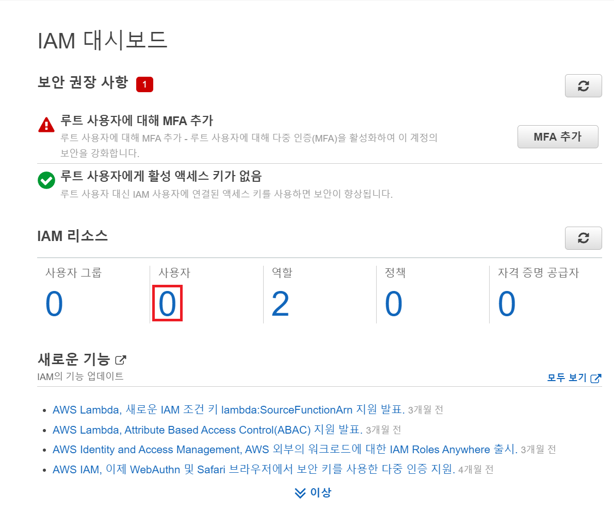
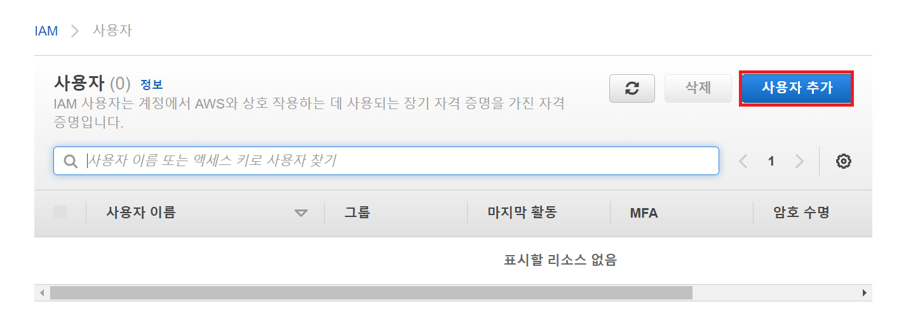
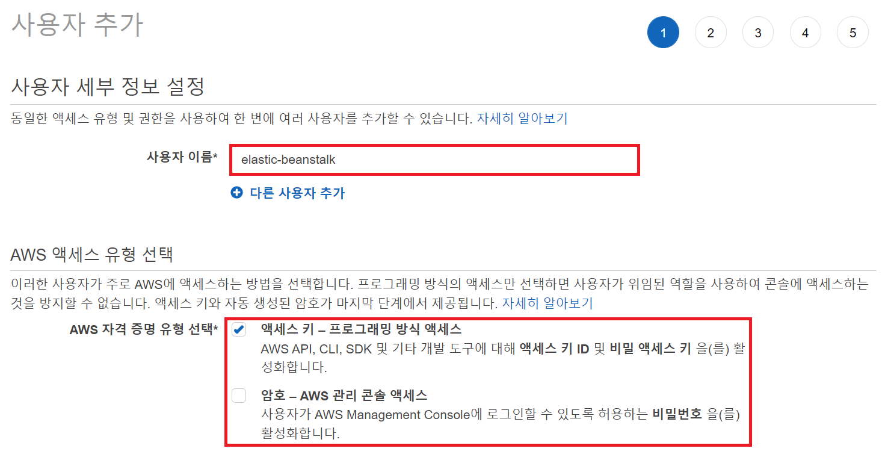
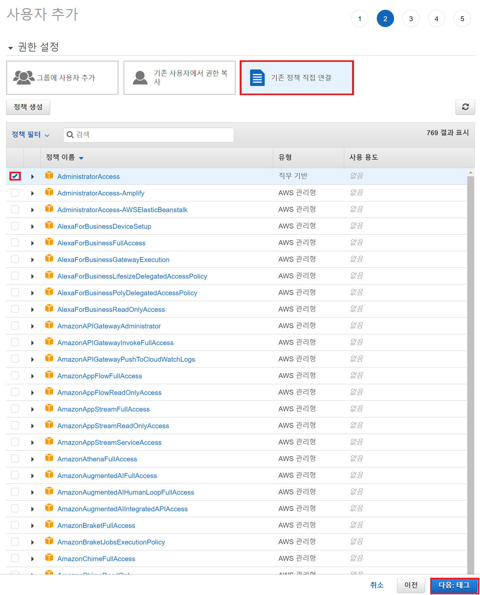
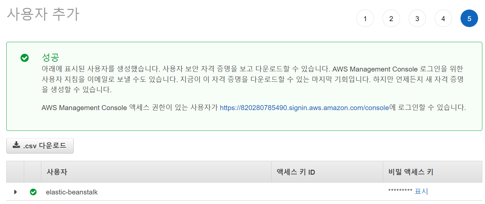

# 루트 계정과 IAM 계정

AWS는 루트 계정과 IAM 계정을 지원한다.

루트 계정은 AWS 서비스 및 리소스에 대한 모든 액세스 권한을 지닌 계정이다. 단, 루트 계정이 탈취당했을 때의 피해를 고려해 AWS는 공식적으로 루트 계정을 사용하지 않는 것을 권장한다.

그 대안으로 주어지는 것이 IAM 계정이다. IAM 계정은 하나의 AWS 계정을 공유하며, 각각 분리된 권한을 갖게 된다.

# IAM 계정 생성

### 1. AWS 루트 계정 로그인 - 서비스 - IAM - 사용자 추가

### 2. 사용자 이름과 엑세스 유형 선택

- CLI를 사용할 것이므로 엑세스 키 방식 선택

### 3. IAM 권한 부여

- 생성된 그룹이 없으니 기존 정책에 직접 연결
- `admin` 권한 부여

### 4. 생성 완료

