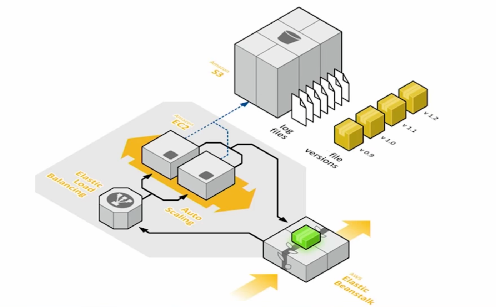

# AWS Elastic Beanstalk

> 어플리케이션 인프라를 구성하는 것에 들이는 노력을 총 100%라 보았을 때, On-premise 수동 구성은 100%, AWS EC2와 같은 가상 머신을 이용한 수동 구성은 50% 정도
>
> Elastic Beanstalk은 이를 최대한 간소화해 10% 미만으로 만들고자 한다.

### 기존의 문제점은 무엇인가?

- **배포, 프로비저닝, 관리**가 복잡하다
- 서버, 데이터베이스, 로드 밸런서, 방화벽 그리고 복잡한 네트워크를 구성하고 관리하는데 **전문성과 시간이 필요**하다
- 어플리케이션의 **스케일 아웃/인 자동화**가 필요하다.
- 배포 시에 **팀내/팀간 갈등**이 발생한다.

### Elastic Beanstalk은 무엇인가?

웹 어플리케이션/웹 서비스를 배포하고, 확장하고, 관리하는데 있어 쉽고 빠르게 할 수 있도록 돕는 완전 관리형 서비스

### Elastic Beanstalk의 이점

- 어플리케이션 프로토타입 원클릭 배포를 가능하게 해준다.
- 코딩에만 집중할 수 있다.
- Elastic Beanstalk 내의 모든 인스턴스에 접근할 수 있다.
- 불필요한 자원 낭비 없이 사용량만큼만 과금한다.
- AWS 리소스 외의 추가 비용은 없다.

### 대표적인 사용 사례

- 웹 사이트
- 모바일 백엔드
- API 백엔드

### 인프라스트럭쳐 스택 구성 과정

1. Elastic Beanstalk 환경 구성
2. 로드밸런서 추가
3. 오토 스케일링 그룹 설정
4. 적절한 수의 인스턴스 배치
5. 모든 구성 요소 연결
6. 엔드 유저가 사용할 DNS 설정을 통해 외부에 publish
7. 로그와 앱 버전에 대한 설정은 S3에 저장